<div align="center">

# axiom

**The desktop shell behind [Axiom Dotfiles](https://github.com/axiom-dotfiles): a complete [Hyprland](https://hypr.land) desktop, written in QML for [Quickshell](https://quickshell.org).**

Every bar, overlay page and setting is built from inside the shell. Drag, drop, save: there are no config files to write.

Bar · Overlay · Launcher · Notifications · Lockscreen · OSD · Power menu · Workspace overview · Screen border

[](https://github.com/axiom-dotfiles/axiom)
[](https://github.com/axiom-dotfiles/axiom)
[](https://hypr.land)
[](https://quickshell.org)
[](LICENSE)

[Built in the shell](#%EF%B8%8F-built-in-the-shell) · [Features](#-features) · [Requirements](#-requirements) · [Install](#-installation) · [IPC](#%EF%B8%8F-keybinds-and-ipc) · [Configuration](#%EF%B8%8F-configuration) · [Acknowledgments](#-acknowledgments)

</div>

https://github.com/user-attachments/assets/a53f62e0-e2bc-4834-a05f-92b6cb115c35

## 🔭 At a glance

| | |
| --- | --- |
| 🛠️ **Built in the shell** | Bars, overlay pages and every setting are edited on your desktop, and changes show as you make them. The layout is data, not code. |
| 📦 **Everything in one place** | One repository and one config for the whole desktop. Beyond Hyprland and Quickshell, the only requirements are `python3` and `jq`. |
| 🛡️ **Built not to break** | An invalid config never replaces the running one. Old configs migrate themselves, and API keys stay out of `config.json`. |
| 🎨 **One theme everywhere** | Base16 themes, or one generated from your wallpaper, applied to 18 other apps. |
| 🤝 **Fits your setup** | Three Hyprland modes, from hands-off to fully managed, and three lockscreen modes. |
| 🖥️ **Multi-monitor** | Bars and wallpapers per monitor. Surfaces open on the primary monitor, the focused one, or all of them. |

## 🛠️ Built in the shell

The whole desktop is described by one config: which bars exist and what's on them, which pages the overlay has and what each card holds, and every setting. The shell has an editor for all of it.

> [!NOTE]
> **Both setups in this README, A and B, were built entirely with these editors and the Settings page. No file was edited by hand.** They're two saved configs, and switching between them is one click under **Settings → Backups** (or `/config restore <name>` in the launcher).

| Bar editor | Overlay editor |
| :---: | :---: |
| 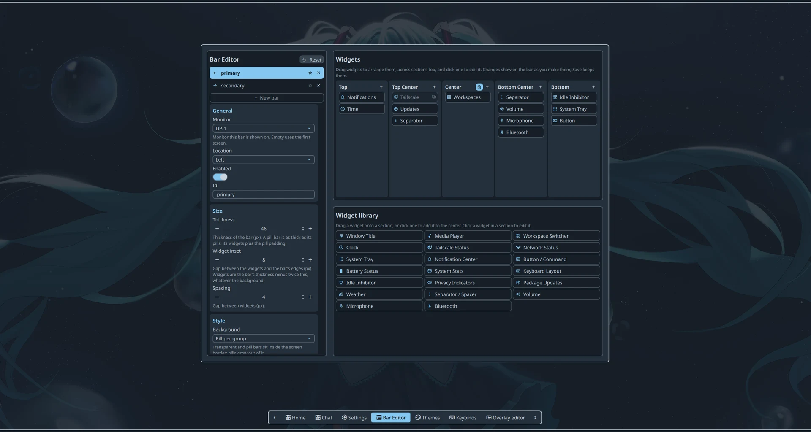 | 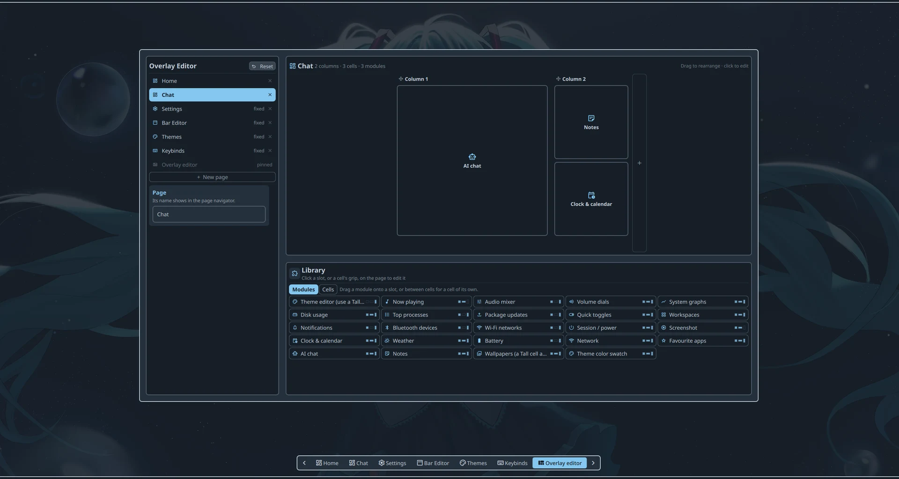 |

**Bar editor**
- Add as many bars as you like, on any monitor and any edge. Each one can be solid, transparent, or split into pills.
- Drag widgets from the library into a bar's five sections, and between sections. Click a widget to edit its options.
- Every change shows on your running bars as you make it. **Save** keeps it and **Reset** drops it.

**Overlay editor**
- Add, rename and reorder pages.
- Drag modules and cell layouts from the library onto a page, or between cells to give a module a cell of its own. Dropping a module on an occupied slot swaps the two.
- It only offers modules that fit a slot's shape, and anything that doesn't fit blocks **Save** until it's fixed.

**Settings**
- Generated from the schema that defines the config, so every option is in the UI.
- Any setting can also be set from the launcher: `/config Appearance.font.size 14`.
- **Backups** saves the whole config under a name, to restore later.

<details>
<summary><b>The editors in setup B</b></summary>

| Bar editor | Overlay editor |
| :---: | :---: |
| 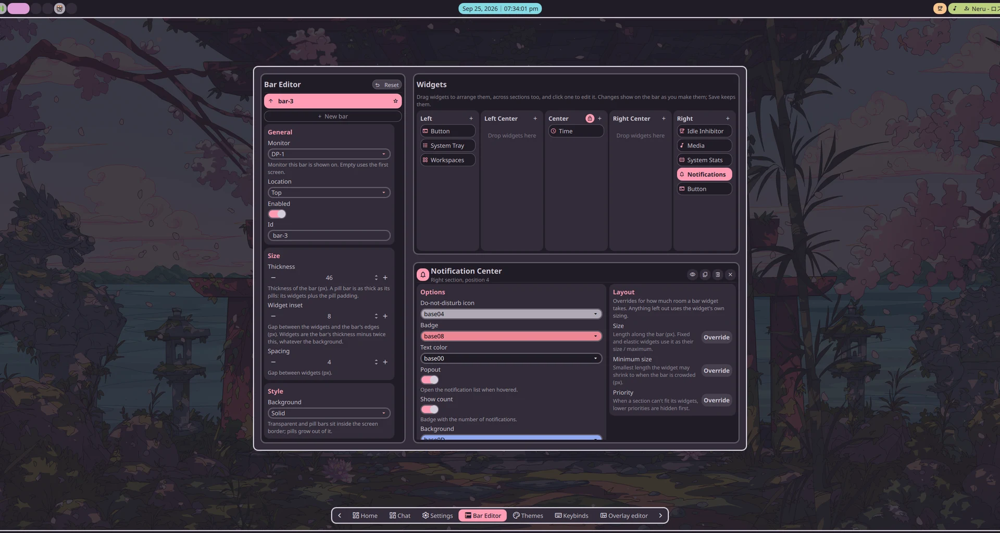 | 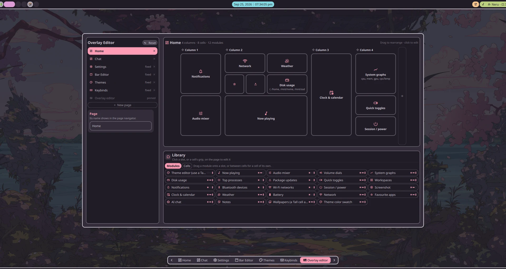 |

</details>

## ✨ Features

The screenshots show [two setups](#%EF%B8%8F-built-in-the-shell) of the same shell. **A** has a pill bar and a transparent bar down the sides of the screen, and **B** has one solid bar across the top, with rounder corners and a thicker border.

### 📊 Bar

| A: pill bars on the sides | B: one solid top bar |
| :---: | :---: |
| 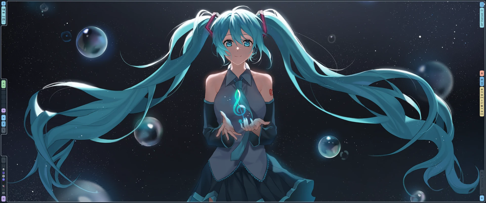 | 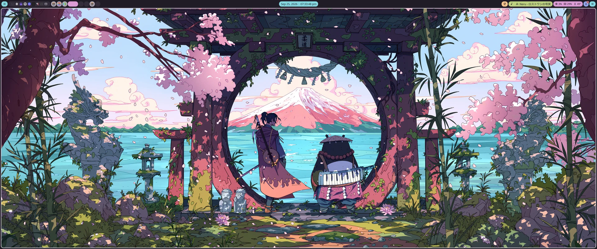 |

- Bars are defined in config. You can have any number, on any monitor and any edge. Each one can be solid, transparent, or split into floating pills.
- 20 widget types: Workspaces, Window, Time, Media, Volume, Microphone, Network, Bluetooth, Battery, SystemStats, SystemTray, Notifications, Updates, Weather, Tailscale, KeyboardLayout, IdleInhibitor, Privacy, Button (runs any command) and Separator.
- Popouts grow out of the bar, or out of the screen border, with filleted corners. Widgets open theirs on hover:
  - a calendar
  - the audio mixer
  - Bluetooth and Wi-Fi menus
  - live system graphs
  - the forecast
  - pending updates, and more

  Buttons can run their action on hover too.
- Edge menus pop out of any screen edge, filled with the overlay's modules. A floating menu opens over your windows. An integrated one opens outside the screen border and bars, pushing them and your windows inwards. A Pin module keeps a menu open. Open one from a bar Button, its edge, or IPC. Each has its own padding, colours, hover timings and (integrated) a framed box along the whole edge, and a keybind can toggle one. Build them on the **Edge menu editor** page, where **Show on screen** keeps the menu open while you edit it.

<details>
<summary><b>Popouts</b></summary>

**A:** growing out of the pills, or merging around them

| Calendar | Audio mixer | Forecast |
| :---: | :---: | :---: |
| 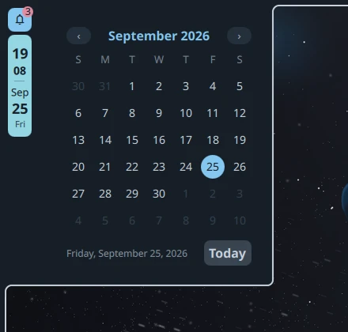 | 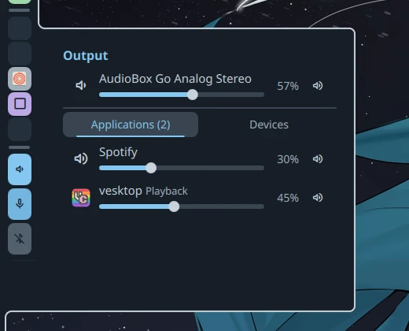 | 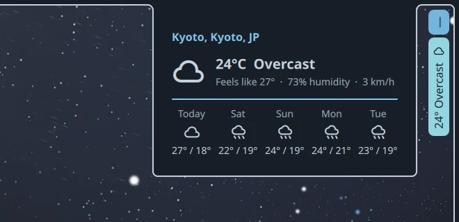 |
| **System graphs** | **Now playing** | **Notifications** |
| 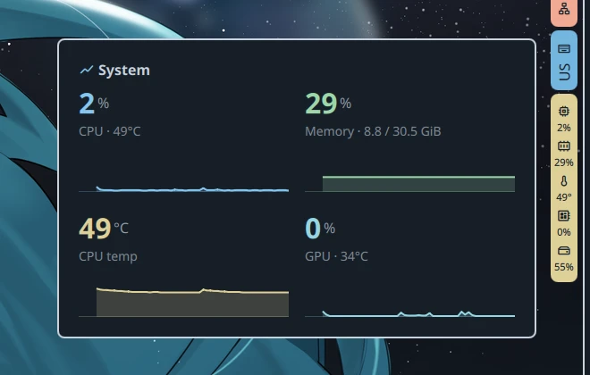 | 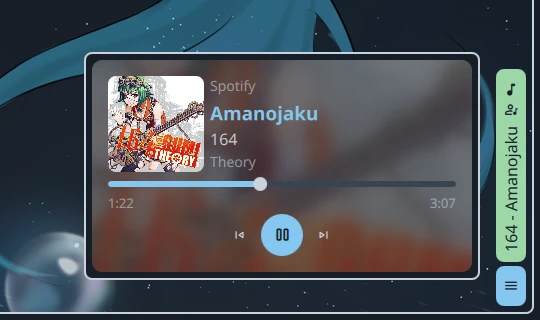 | 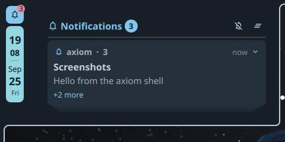 |
| **Wi-Fi** | **Bluetooth** | **Updates** |
| 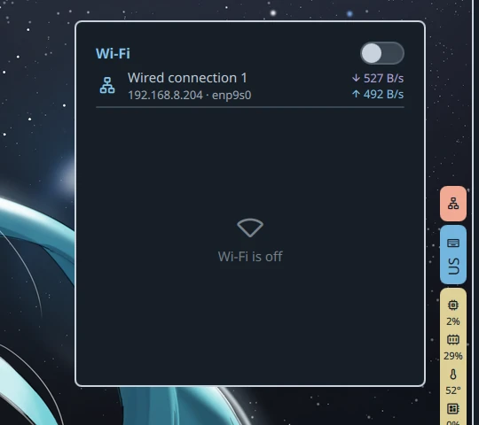 | 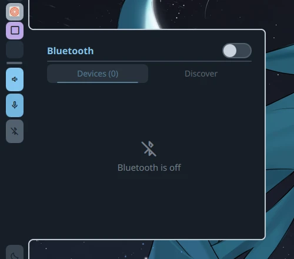 | 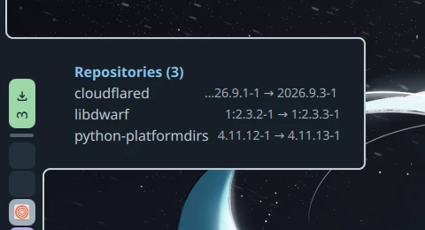 |
| **Workspace grid** | | |
| 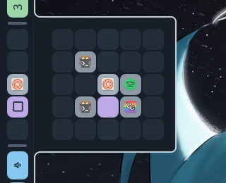 | | |

**B:** growing out of the top bar, joining the screen border at its end

| Calendar | Now playing |
| :---: | :---: |
| 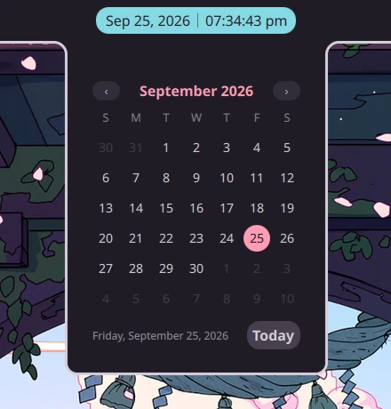 | 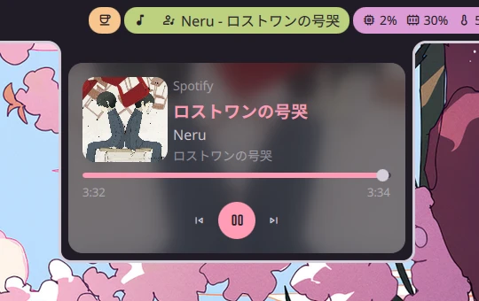 |
| **Notifications** | **System graphs** |
| 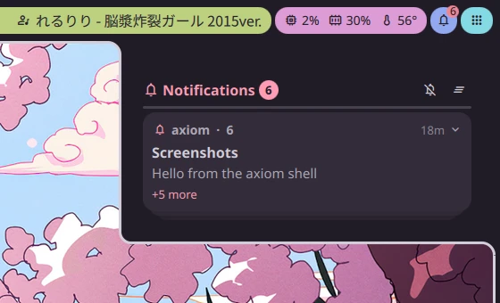 | 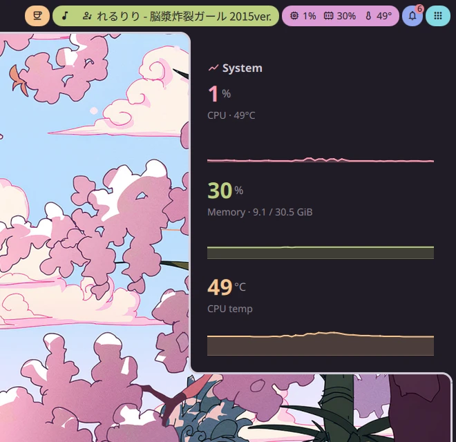 |

</details>

### 🗂️ Overlay

| A | B |
| :---: | :---: |
| 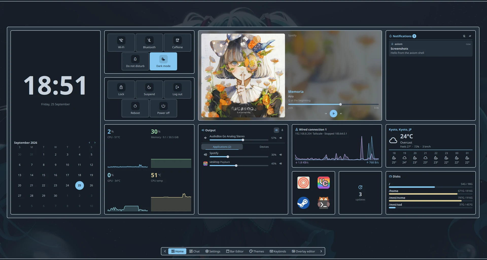 | 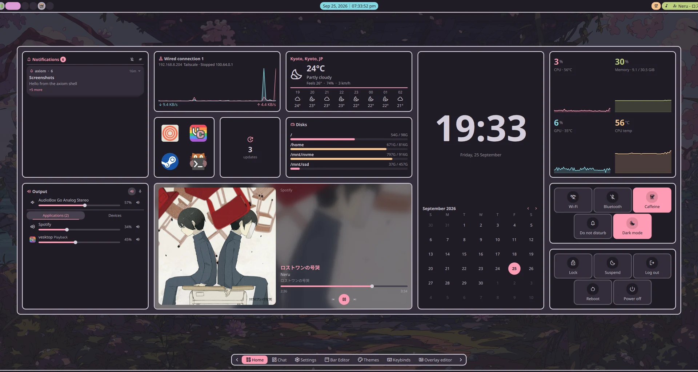 |

- A full-screen overlay made of pages of cards. Each page is built from columns, each column from cells, and each cell holds modules.
- 24 modules, including:
  - a media player, audio mixer, system graphs and top processes
  - disks, updates, quick actions (toggles, power, pin), Bluetooth, network and Wi-Fi networks
  - weather, calendar, notes and favourites
  - screenshot, session controls, a workspace map and AI chat
- Modules adapt to the shape of their slot (square, wide, tall or quarter).
- Built-in pages:
  - **Settings**, generated from the config schema
  - **Bar editor**, **Overlay editor** and **Edge menu editor** (see [Built in the shell](#%EF%B8%8F-built-in-the-shell))
  - **Themes**
  - **Keybinds**

<details>
<summary><b>Built-in pages</b></summary>

| | A | B |
| --- | :---: | :---: |
| **Settings** | 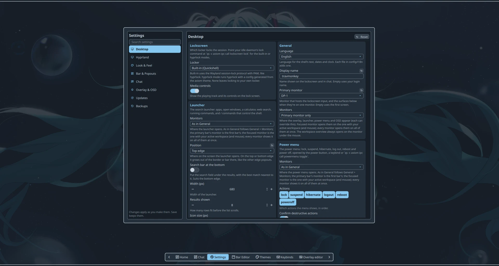 | 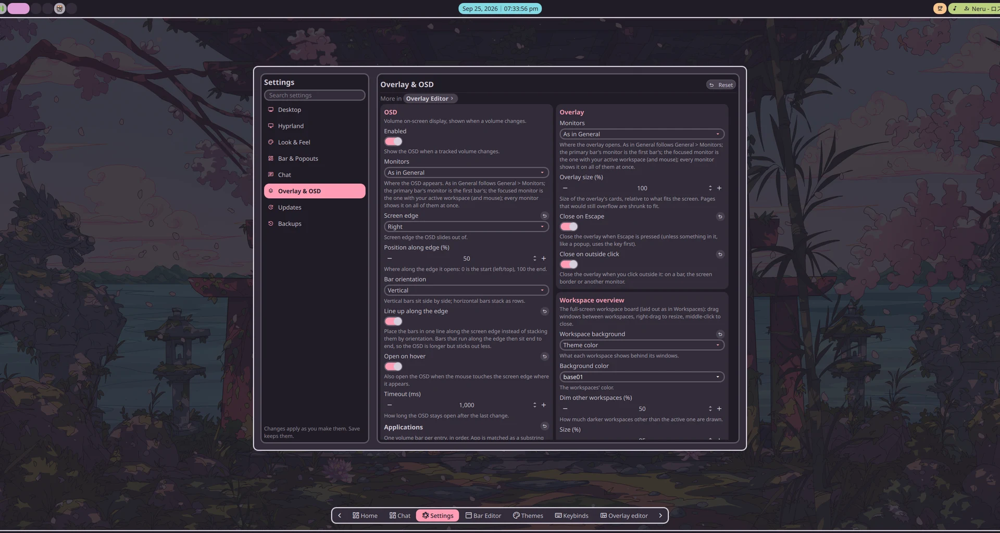 |
| **Keybinds** | 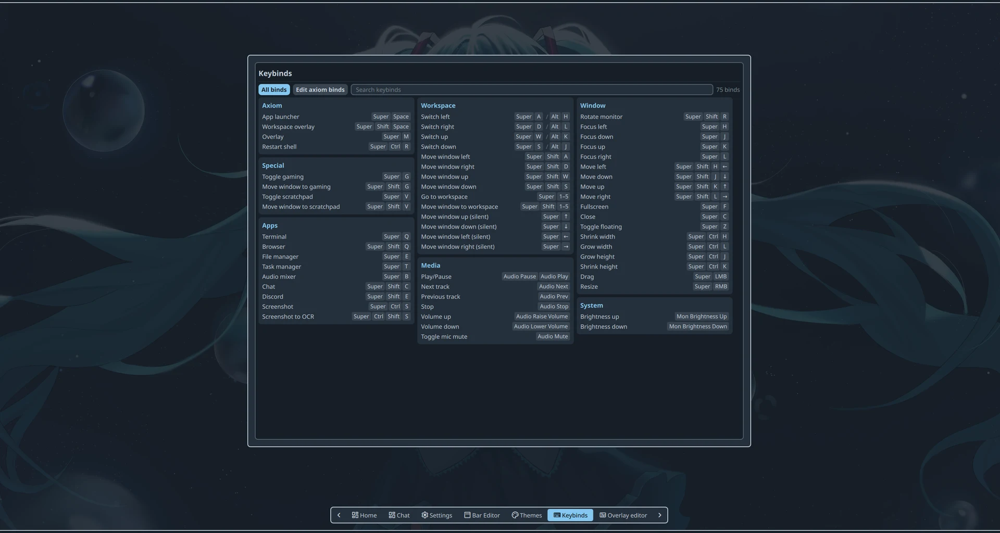 | 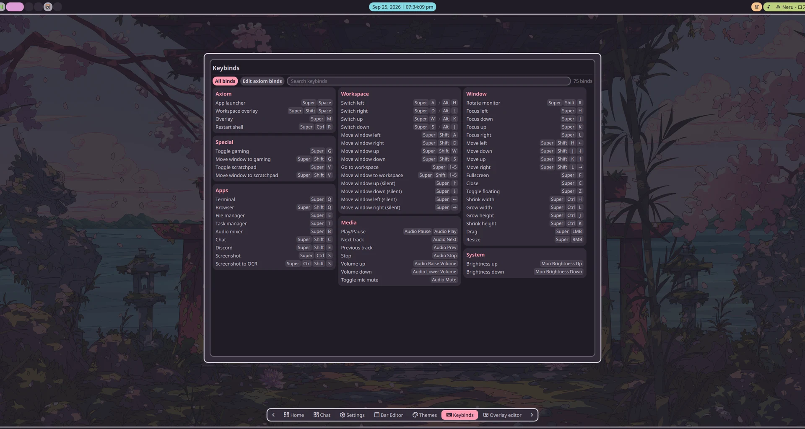 |

</details>

### 🎨 Theming

| | Dark | Light |
| --- | :---: | :---: |
| **A** | 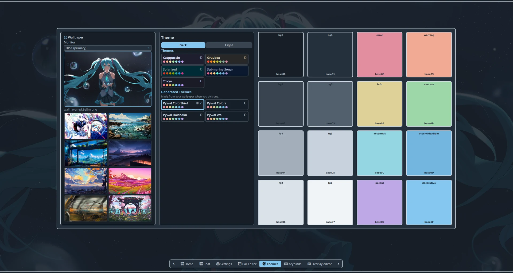 | 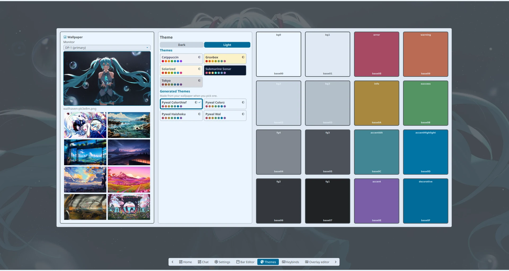 |
| **B** | 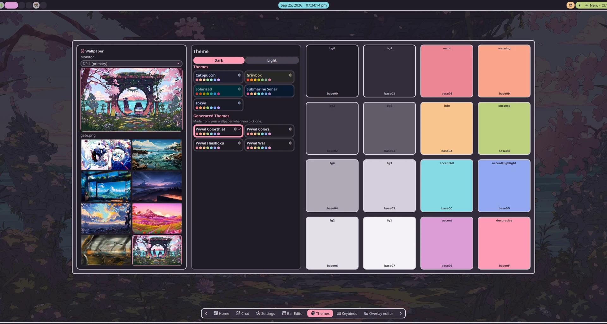 | 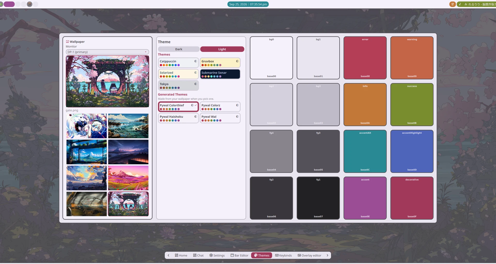 |

- Base16 themes, with dark and light pairs switched by one toggle: Catppuccin, Gruvbox, Solarized, Tokyo Night/Day and Submarine Sonar.
- Generate a theme from your wallpaper. pywal backends pick the candidate colors, then the palette is built in OKLCH to match the contrast of the hand-made themes.
- Wallpapers can be set per monitor, with transitions through [awww](https://github.com/LGFae/awww).
- The active theme is applied to other apps too. Each app is a switch under **Settings → Theme integrations**, gets its own `axiom` theme file, and its switch's description gives the one line to add to its config. Your own config files are never edited.

<details>
<summary><b>Supported apps (18)</b></summary>

| Kind | Apps |
| --- | --- |
| Toolkits | GTK, Qt |
| Terminals | kitty, Alacritty, foot, WezTerm, Ghostty |
| Editors | Neovim, Helix, VS Code |
| CLI tools | k9s, cava, btop, fzf, lazygit, bat/delta, Yazi |
| Lockscreen | hyprlock |

</details>

### 🧩 The rest
- 🔔 **Notifications:** toasts and a notification center. Toasts stack from any corner of one monitor or all of them, with even or per-side gaps measured from the bar or border at each edge. You can set how long they stay (or use the app's own timeout), keep critical ones up, and keep them quiet over fullscreen windows. The history can drop an app's notifications when you focus it, or when you click or close them, and has a size and age limit. Do not disturb is kept across restarts.
- 🔊 **OSD:** follows the volume of the apps you choose.
- 🚀 **Launcher:** searches apps (ranked by how often and how recently you use them), open windows, a calculator and the web. It runs shell commands and controls the shell with `/` commands.
- ⏻ **Power menu:** your choice of session actions, in your order, driven by mouse or keyboard. Log out, reboot and power off ask you to confirm.
- 🧭 **Workspaces:** laid out as 1 to N, or as a grid per monitor (5×5 by default) that you move around by row and column. The bar widget, the workspace map, the workspace overlay and your keybinds (through the `workspaces` IPC target) all follow the one setting.
- 🪟 **Workspace overlay:** live window previews. Drag a window onto a side of another window or onto another workspace, right-drag to resize it, and middle-click to close it.
- 🤖 **AI chat:** Anthropic, OpenAI, Gemini, or anything with an OpenAI-style API (Ollama, LM Studio, OpenRouter, …). Replies stream in as formatted Markdown with copyable code blocks and folded thinking. Also: saved conversations, presets (system prompt, model, effort), image attachments (paste, screenshot a region, drop) and `@` in the launcher to ask a question. API keys come from environment variables, your keyring or a mode-600 secrets file, never `config.json`.
- 🔒 **Lockscreen:** three modes: the built-in `ext-session-lock` locker (PAM), a themed hyprlock config that axiom generates, or none.
- 🖥️ **Multi-monitor:** interactive surfaces open on the primary monitor, or on whichever monitor has focus.
- 🌐 **Translations:** English and Japanese, with more added as a single JSON file each.

| | A | B |
| --- | :---: | :---: |
| **Workspace overlay** | 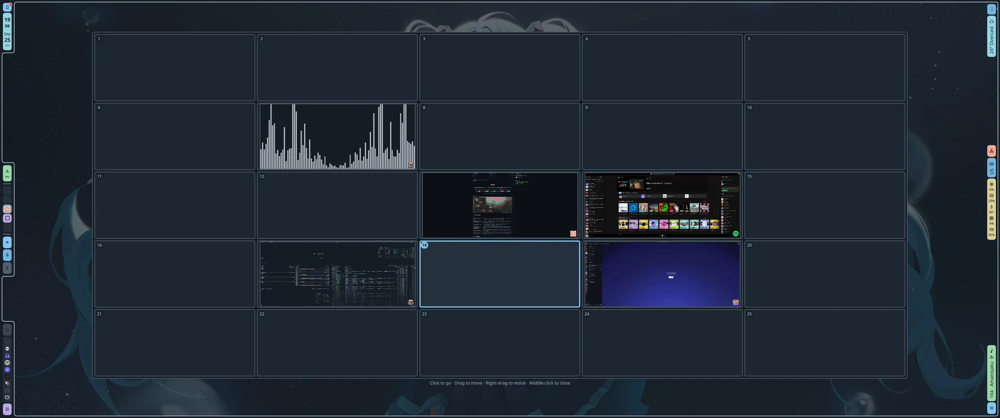 | 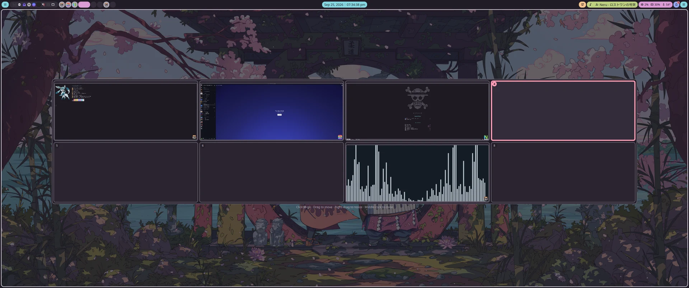 |
| **AI chat** | 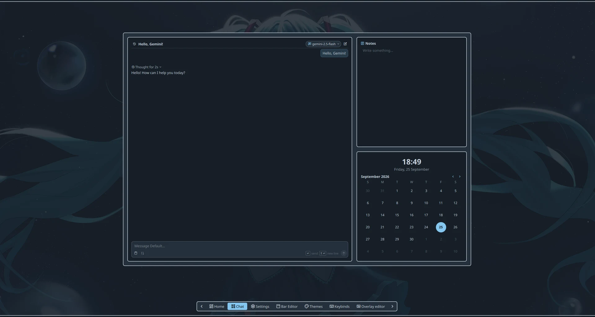 | 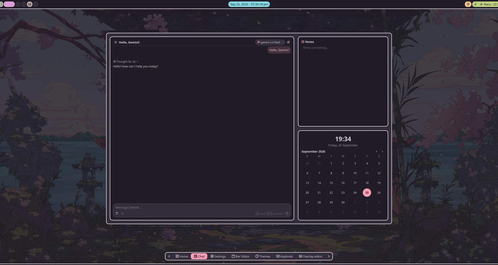 |
| **Power menu** | 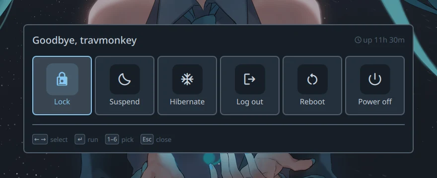 | 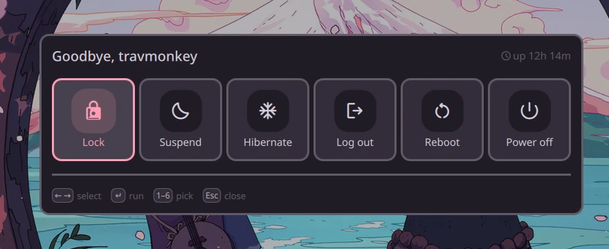 |
| **Notification** | 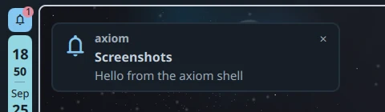 | 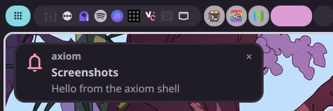 |
| **OSD** | 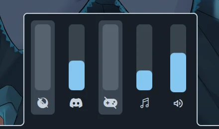 | 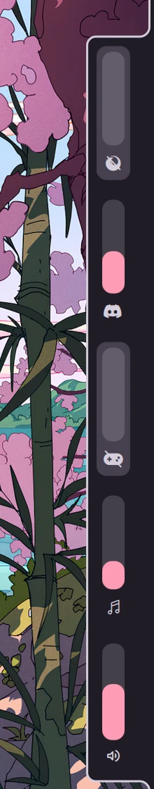 |

## 📋 Requirements

The whole shell runs on four things. Everything else is optional and only needed for the feature that uses it.

**Required**
- [Hyprland](https://hypr.land) 0.55 or newer, with its Lua config (`hyprland.lua`)
- [Quickshell](https://quickshell.org) 0.3.1 or newer (`qs`)
- [Material Symbols](https://fonts.google.com/icons) for icons (`ttf-material-symbols-variable`). Any font works for text
- `jq`, `python3`

<details open>
<summary><b>Optional</b>, for the features that use them</summary>

| Feature | Needs |
| --- | --- |
| Wallpapers | `awww` |
| Theme generation | ImageMagick (`magick` or `convert`). The Python packages are installed into `.venv` automatically from `scripts/requirements.txt` |
| Network widget / module, Wi-Fi menu | NetworkManager, Quickshell built with its Networking module, and `ip` (iproute2) |
| Updates | `pacman-contrib` (`checkupdates`), plus `paru` or `yay` for AUR updates |
| Tailscale | `tailscale` |
| Screenshot module | `grim`, `slurp`, `wl-copy` |
| AI chat | `curl`; `secret-tool` (libsecret) to keep keys in your keyring; `wl-clipboard`, `grim` and `slurp` for image attachments |
| Launcher calculator | `qalc` (libqalculate), `wl-copy` |
| Brightness (keys, OSD bar) | `brightnessctl` for a laptop panel; `ddcutil` for external monitors over DDC/CI (monitors that support it, with i2c access: the package's udev rule gives it to the logged-in user) |
| NVIDIA GPU stats | `nvidia-smi` (AMD is read from sysfs) |
| hyprlock mode | `hyprlock`, and `hypridle` to lock on idle |
| Theme integrations | The app itself (`kitty`, `alacritty`, `foot`, `wezterm`, `ghostty`, `nvim`, `helix`/`hx`, VS Code or VSCodium, `k9s`, `cava`, `btop`, `fzf` 0.49+, `lazygit`, `bat`, `yazi` 25.5+); `qt5ct`/`qt6ct` for Qt; `adw-gtk-theme` for GTK3 apps |

</details>

## 🚀 Installation

On Arch Linux, run the installer:

```bash
curl -fsSL https://raw.githubusercontent.com/axiom-dotfiles/axiom/main/install.sh | bash
```

Every package it installs comes from the official repositories. It installs the required packages and asks about each optional feature. Then it clones the latest release into `~/.config/quickshell/axiom` and sets up the Python venv. Last, it asks before adding the line that starts axiom to the end of your `hyprland.lua`, backing up the file first. `--yes` answers yes to every question, and `--minimal` installs only what's required. Running it again is safe. From a clone, run `./install.sh`.

<details>
<summary><b>By hand</b>, or on another distribution</summary>

Install the [requirements](#-requirements), then clone into Quickshell's config directory:

```bash
git clone https://github.com/axiom-dotfiles/axiom.git ~/.config/quickshell/axiom
```

Start it from your Hyprland config (`hyprland.lua`):

```lua
hl.on("hyprland.start", function() hl.exec_cmd("qs -c axiom") end)
```

</details>

> [!TIP]
> **After installing, look through [axiom-dotfiles/hypr](https://github.com/axiom-dotfiles/hypr)**, the Hyprland config axiom is developed with. axiom's keybinds and settings only cover the shell itself. That repo has the rest of a desktop: window-management binds, media and brightness keys, screenshots, window rules, animations, helper scripts, and `hypridle`/`hyprlock` configs. It's laid out for managed mode as `user/*.lua` files, but you can copy whatever's useful into your own config. The keybinds file reads its shared values from `lib/variables.lua`.

That's all Hyprland needs. How axiom sets up the rest is **Settings → Desktop → Hyprland → Mode**:

| Mode | What it does |
| --- | --- |
| **Detached** (default) | Applies axiom's keybinds and required settings at runtime, and again after every Hyprland reload. It writes no files, and skips any keybind whose key your config already uses. |
| **Included** | Writes `~/.local/state/axiom/hyprland.lua` (under `$XDG_STATE_HOME` if it's set). Load it near the top of your `hyprland.lua`, and anything after it overrides axiom (see below). |
| **Managed** | axiom writes `~/.config/hypr/hyprland.lua` itself, from the **Managed config** settings: layout (dwindle, master or scrolling), gaps, borders, opacity, blur, shadows, animation styles, keyboard, mouse, cursor and touchpad, behaviour (swallowing, VRR, focus), environment variables and autostart commands. It then loads your own `~/.config/hypr/user/*.lua` after it, in name order, as `require("user.<name>")`, so Hyprland reloads when one changes. Shared modules go in `user/lib/`, which isn't loaded on its own. `user/` itself may be a symlink, for example into a dotfiles repo. The first time, your old `hyprland.lua` is backed up and moved to `user/00-previous.lua`. |

> [!IMPORTANT]
> Managed mode never takes over a `~/.config/hypr` that is a symlink or in a git repository.

For the included mode, add:

```lua
local ok, axiom = pcall(dofile, os.getenv("HOME") .. "/.local/state/axiom/hyprland.lua")
if ok then axiom.setup() end
```

> [!TIP]
> `setup()` applies everything switched on in the settings. To pick parts yourself, call `axiom.required()`, `axiom.binds()`, `axiom.theme()` and `axiom.blur()` instead. `hl.unbind("KEY")` after it frees one of axiom's keys.

Whichever mode is set, axiom falls back to the runtime layer when its file isn't loaded, and logs why.

The same settings page holds switches for:
- **required settings:** `misc.allow_session_lock_restore`, and a `workspaces` animation for the grid's slides
- **theme-coloured window borders**
- **blur behind axiom's surfaces**
- **starting `awww-daemon`**

Keybinds are edited on the **Keybinds** page. A bind can run any IPC action below, a window action (focus, move, resize, close, fullscreen, floating, special workspaces, mouse drag), or a command, and can repeat while held, work while locked or fire on release. Presets add window management on SUPER + H J K L and the media keys. A description like `Workspace: Switch left` puts the bind in its own section on that page.

### 🔄 Updates

axiom updates itself from release tags (`v*`) on the repository you cloned it from. It checks when the shell starts and once a day. **Settings → Updates** picks what happens next:

| Mode | What it does |
| --- | --- |
| **Notify me** (default) | Sends a notification. Clicking it opens **Settings → Updates**, which shows what's new and has an **Update** button. |
| **Update automatically** | Installs the new release, reloads the shell, and notifies you. |
| **Off** | Never checks. **Check now** still works. |

An update only fast-forwards your clone. It won't touch a clone that has changed files, commits of its own, or a branch other than `main`. The page says why, and you update it yourself with git. Your config, state and generated themes aren't tracked by git, so an update never changes them.

## ⌨️ Keybinds and IPC

Every surface can be controlled over Quickshell IPC, so you can bind it to anything:

```bash
qs -c axiom ipc call <target> <function>
```

<details>
<summary><b>IPC targets</b></summary>

| Target | Functions |
| --- | --- |
| `overlay` | `open`, `close`, `toggle`, `page <type>` |
| `edgeMenu` | `open <id>`, `close <id>`, `toggle <id>`, `pin <id>`, `unpin <id>`, `list` |
| `appLauncher` | `open`, `close`, `toggle`, `search <text>` |
| `powermenu` | `open`, `close`, `toggle` |
| `workspaceOverlay` | `show`, `hide`, `toggle` |
| `workspaces` | `go <id>`, `move <id>`, `moveSilent <id>`, `left`, `right`, `up`, `down`, `step <direction> <mode>`, `nth <n> <mode>` |
| `idleInhibit` | `enable`, `disable`, `toggle`, `status` |
| `lockscreen` | `lock` |
| `notifications` | `clear`, `toggleDnd` |
| `selfUpdate` | `check`, `update`, `open` |
| `chat` | `open`, `newChat`, `ask <text>`, `settings` |
| `audio` | `volumeUp`, `volumeDown`, `toggleMute`, `toggleMicMute` |
| `media` | `playPause`, `next`, `previous` |

</details>

If you bind them in your own `hyprland.lua` instead of through axiom's settings, it looks like this. A `"Section: Label"` description sets where the bind appears on the Keybinds page:

```lua
hl.bind("SUPER + SPACE", hl.dsp.exec_cmd("qs -c axiom ipc call appLauncher toggle"), { description = "Axiom: App launcher" })
hl.bind("SUPER + T", hl.dsp.exec_cmd("qs -c axiom ipc call appLauncher search '/theme '"), { description = "Axiom: Themes" })
```

### 🚀 Launcher

Plain text searches apps and open windows. When the text is math, the result shows first, and a web search comes last. A prefix picks one kind of search:

| Prefix | Does |
| --- | --- |
| `/` | Shell commands (list below) |
| `=` | Calculator (qalc: math, units, currencies). Enter copies the result |
| `>` | Runs a shell command. Shift+Enter runs it in your terminal |
| `?` | Web search, with the engine set in Settings |
| `@` | Asks the overlay's chat, in a new conversation |

| | Apps | Commands | Calculator |
| --- | :---: | :---: | :---: |
| **A:** attached to the top, field above | 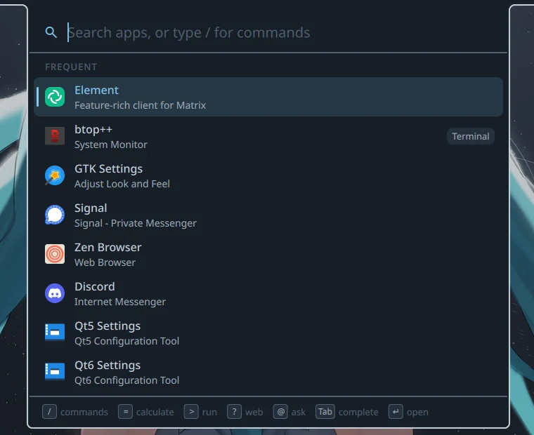 | 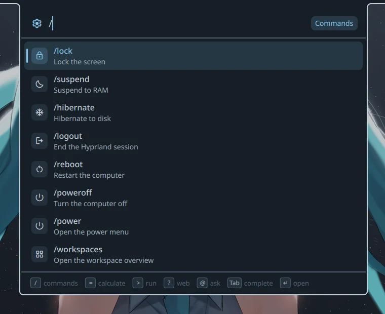 | 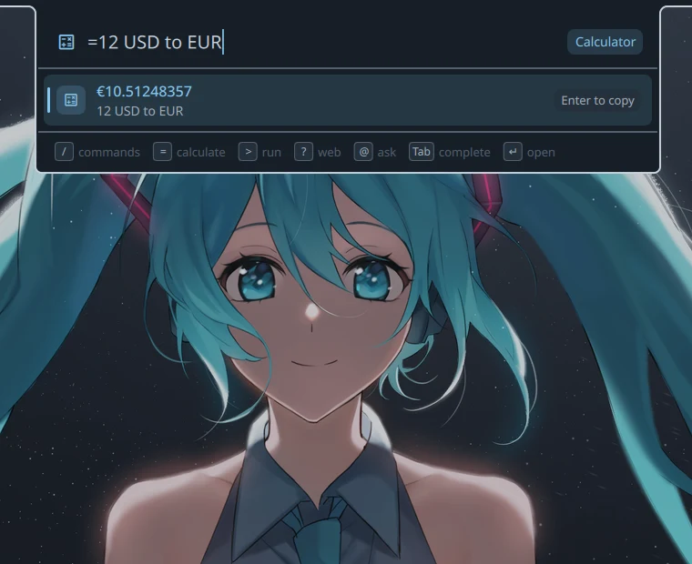 |
| **B:** attached to the bottom, field below | 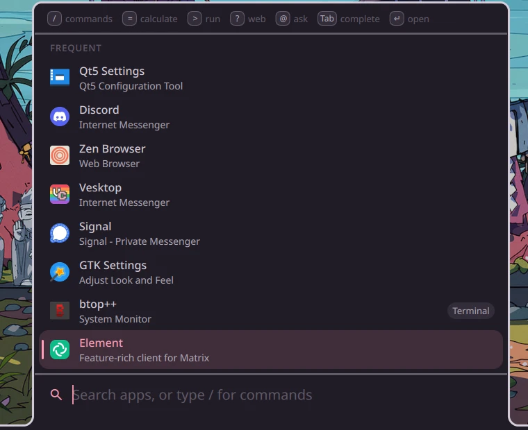 | 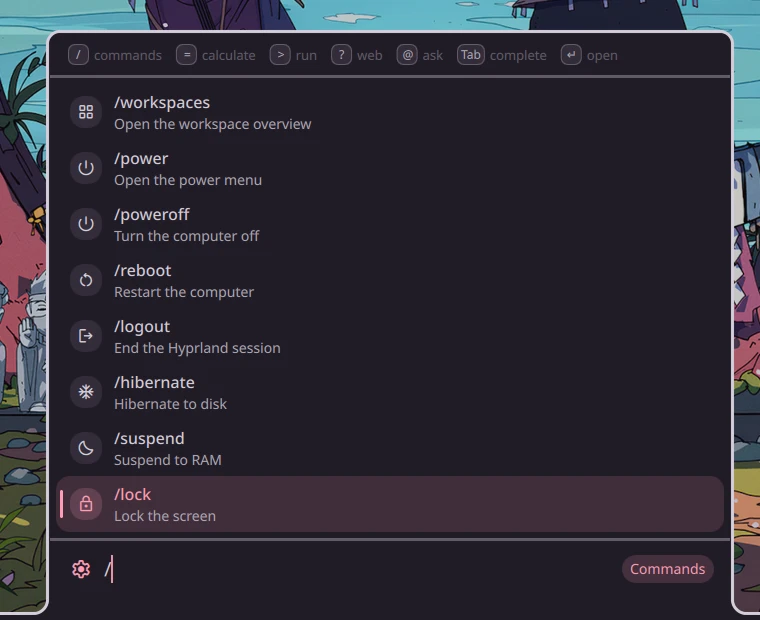 | 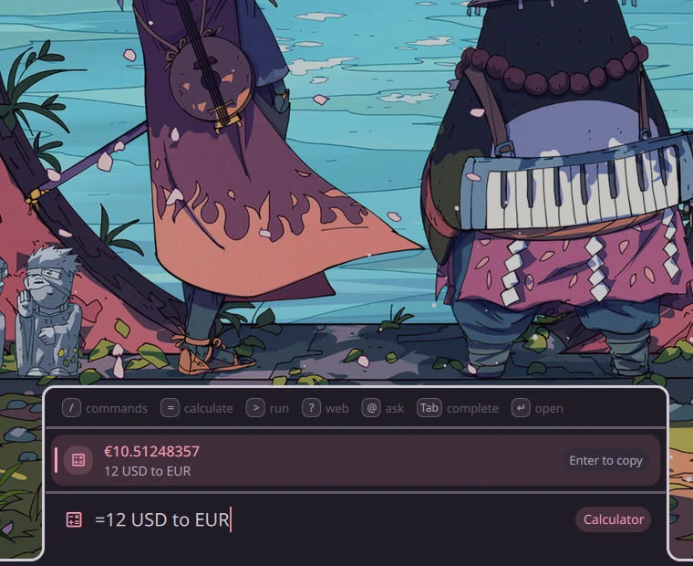 |

<kbd>Tab</kbd> completes a command or its argument. Commands that change something you can see, like the theme, volume or wallpaper, keep the launcher open, so you can try several. `logout`, `reboot` and `poweroff` ask for a second <kbd>Enter</kbd>.

| Group | Commands |
| --- | --- |
| **Session** | `/lock` `/suspend` `/hibernate` `/logout` `/reboot` `/poweroff` `/power` |
| **Pages** | `/overlay [page]` `/settings` `/themes` `/bar` `/keybinds` `/editor` `/workspaces` |
| **Look** | `/theme <name>` `/dark` `/light` `/mode` `/wallpaper <file\|Random>` `/generate` |
| **Audio and media** | `/volume <n\|+n\|-n>` `/mute` `/mic` `/output <device>` `/input <device>` `/play` `/next` `/prev` |
| **Connectivity** | `/wifi [on\|off]` `/bluetooth [on\|off]` `/connect <device>` |
| **Other** | `/dnd [on\|off]` `/clear` `/caffeine [on\|off]` `/ws <n>` `/config <setting> <value>` `/config save <name>` `/config restore <name>` `/update` `/reload` `/help` |

Every provider can be switched off under **Settings › Desktop › Launcher**. The same page sets:
- the launcher's size, hidden apps, terminal and search engine
- where it opens: floating (centered or in the upper third), or attached to the top or bottom edge like the other edge popouts
- whether the search field sits above or below the results

### 🔒 Locking with hypridle

For the `quickshell` and `hyprlock` lockscreen modes:

```ini
general {
    lock_cmd = qs -c axiom ipc call lockscreen lock
    before_sleep_cmd = loginctl lock-session
}
```

In `none` mode axiom doesn't register the `lockscreen` target. Point hypridle at your own locker, and set **Lockscreen → Lock command** so that axiom's lock buttons run it too.

## ⚙️ Configuration

Everything is configured from inside the shell (see [Built in the shell](#%EF%B8%8F-built-in-the-shell)). Open the overlay, and use the **Settings**, **Bar editor**, **Overlay editor**, **Edge menu editor** and **Themes** pages.

- Settings are saved to `config/user/config.json`. You never need to open it, but the shell watches that file and reloads when it changes, so editing it by hand also works.
- Configs from older versions are migrated automatically.
- `config/json/config.schema.json` defines every option and its default. It also generates the Settings page.
- Chat API keys are entered in **Settings → Chat** and stored in your keyring (or `$XDG_STATE_HOME/axiom/secrets.json`, mode 600, without one). A provider's environment variable (`ANTHROPIC_API_KEY`, `OPENAI_API_KEY`, `GEMINI_API_KEY`) wins over a stored key. Conversations are saved in `$XDG_STATE_HOME/axiom/chats/`.

> [!IMPORTANT]
> An invalid `config.json` never replaces the running config. The shell keeps the last good one and refuses to save until the file is fixed.

### 🎨 Themes

- Hand-made themes live in `config/themes/`, and generated ones in `config/themes/generated/`.
- A theme is a base16 palette (`base00`–`base0F`) plus optional semantic overrides. See `config/themes/theme.schema.json`.
- To add a theme, drop a JSON file in `config/themes/`. To make a dark/light pair, give each file a `paired` field naming the other.

### 🌐 Translations

- Pick a language in **Settings → General → Language**.
- To add a language, create `config/i18n/<code>.json` (see `ja.json`). It shows up in the dropdown right away.
- Missing strings fall back to English. `scripts/check_i18n.py` reports what's missing.

## 🩺 Troubleshooting

View the shell's log with:

```bash
scripts/log.sh          # warnings and errors since the last reload
scripts/log.sh --debug  # include console.log output
scripts/log.sh -f       # follow
```

A clean reload prints only `Reloading configuration...` and `Configuration Loaded`.

Icons showing as words (`wifi`, `battery_full`) mean the icon font is missing: install `ttf-material-symbols-variable` and restart the shell.

## 🤝 Contributing

Contributions are welcome. [Open an issue](https://github.com/axiom-dotfiles/axiom/issues/new/choose) for a bug or an idea, or fork the repository and open a pull request against `main`. The pull request template has a short checklist, and CI runs the same checks (`scripts/check_structure.py`, `scripts/check_i18n.py`, JSON and script syntax).

See [CONTRIBUTING.md](CONTRIBUTING.md) for the directory layout and conventions, and [CLAUDE.md](CLAUDE.md) for the architecture in detail. There's no build step: `qs` interprets the QML and hot-reloads on save.

## 🗺️ Roadmap

- [x] Installer
- [x] v1.0, the first stable release
- [ ] Onboarding and a setup wizard
- [ ] Clipboard manager
- [ ] More translations
- [x] Collaboration: CI, issue and pull request templates, changes through PRs

## 🙏 Acknowledgments

axiom is built on:
- [Hyprland](https://hypr.land), the compositor it's made for
- [Quickshell](https://quickshell.org), the QML toolkit every surface is written in
- [Material Symbols](https://fonts.google.com/icons), the icons
- [pywal16](https://github.com/eylles/pywal16) and its backends ([colorz](https://github.com/metakirby5/colorz), [colorthief](https://github.com/fengsp/color-thief-py), [haishoku](https://github.com/LanceGin/haishoku)), which pick the candidate colors for generated themes
- [awww](https://github.com/LGFae/awww), for wallpapers and their transitions

Four of the five theme pairs are ports of [Catppuccin](https://catppuccin.com), [Gruvbox](https://github.com/morhetz/gruvbox), [Solarized](https://ethanschoonover.com/solarized/) and [Tokyo Night](https://github.com/tokyo-night/tokyo-night-vscode-theme). Submarine Sonar is axiom's own.

And thanks to the Hyprland desktops that inspired it: [illogical-impulse](https://github.com/end-4/dots-hyprland), [caelestia-dots](https://github.com/caelestia-dots) and [JaKooLit's Hyprland-Dots](https://github.com/JaKooLit/Hyprland-Dots).

## 📄 License

[MIT](LICENSE)
