<div align="center">

# axiom

**A lite desktop environment for [Hyprland](https://hypr.land): bring your own apps, build the rest on screen.**

Bars, menus, a launcher, notifications, settings, theming, the lock screen and the login screen: one application, laid out with drag and drop and set from the UI.

<a href="https://github.com/axiom-dotfiles/axiom/stargazers"><picture><source media="(prefers-color-scheme: light)" srcset="https://img.shields.io/github/stars/axiom-dotfiles/axiom?style=for-the-badge&color=8c6c3e&labelColor=e1e2e7"></picture></a>
<a href="https://github.com/axiom-dotfiles/axiom/tags"><picture><source media="(prefers-color-scheme: light)" srcset="https://img.shields.io/github/v/tag/axiom-dotfiles/axiom?sort=semver&label=version&style=for-the-badge&color=b15c00&labelColor=e1e2e7"></picture></a>
<a href="https://github.com/axiom-dotfiles/axiom/commits/main"><picture><source media="(prefers-color-scheme: light)" srcset="https://img.shields.io/github/last-commit/axiom-dotfiles/axiom?style=for-the-badge&color=587539&labelColor=e1e2e7"></picture></a>
<a href="https://hypr.land"><picture><source media="(prefers-color-scheme: light)" srcset="https://img.shields.io/badge/Hyprland-0.55%2B-2e7de9?style=for-the-badge&labelColor=e1e2e7"></picture></a>
<a href="https://quickshell.org"><picture><source media="(prefers-color-scheme: light)" srcset="https://img.shields.io/badge/Quickshell-0.3.1%2B-9854f1?style=for-the-badge&labelColor=e1e2e7"></picture></a>
<a href="LICENSE"><picture><source media="(prefers-color-scheme: light)" srcset="https://img.shields.io/badge/License-MIT-118c74?style=for-the-badge&labelColor=e1e2e7"></picture></a>

[Why axiom](#why-axiom) · [Highlights](#highlights) · [Example setups](#example-setups) · [What's included](#whats-included) · [Install](#installation) · [Docs](#documentation)

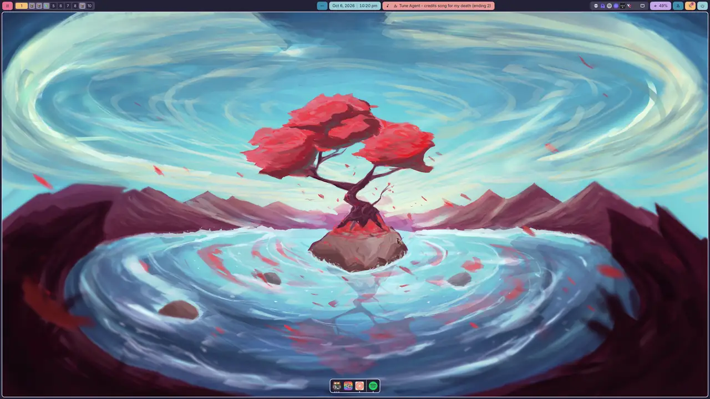

<sub>One shell, infinite desktops, zero edited files. Each is an <a href="#example-setups">example setup</a> you can apply in one click.</sub>

</div>

## Why axiom

Most desktops come finished, with options to adjust. axiom comes in pieces, with the editors to make it yours.

- **Built, not configured.** One set of modules builds pages, sidebars, the lock screen and the login screen. Bars are widgets you line up and style one by one. Every surface is laid out by dragging, with changes live until you save.
- **The whole desktop, one application.** Login, lock, notifications, polkit, idle, OSDs, a launcher, and settings for Wi-Fi, Bluetooth, audio and monitors, from one config. No stack of separate tools to glue together.
- **Bring your own apps.** axiom is the part of a desktop you live in, not the apps inside it. It ships no file manager, terminal or browser: use the ones you like, and axiom themes 23 of them to match.
- **Updates don't fight you.** Your config is validated and migrated from version to version, so a new release never means merging your changes into someone else's dotfiles.
- **Share a look, not a script.** An exported setup is data: monitors, paths and accounts stay behind, and commands come along only if you ask.
- **Trying it costs nothing.** axiom never touches your Hyprland config unless you ask it to. It applies its keybinds at runtime, skips any key you already use, and goes away when you remove its one start-up line.

**Who it's for:** anyone who wants a desktop that's stable, complete and one application rather than a pile of tools and scripts, and that you can still rice as far as you like.

## Highlights

<table>
<tr>
<td width="50%" valign="top">

### 🧩 Build every surface

One grid editor lays out overlay pages, edge menus, the lock screen and the login screen. Changes show live: **Save** keeps them, **Reset** throws them away.


</td>
<td width="50%" valign="top">

### 🎨 Bars in any style

Solid, transparent, pills or floating, on any edge of any monitor. Filled, tinted, outlined or underlined widgets, in slants, arrows or powerline. Colors pick themselves.


</td>
</tr>
<tr>
<td valign="top">

### ↔️ Menus that make room

Edge menus slide out of any edge. A floating one opens over your windows; an *integrated* one pushes them aside like a sidebar, or pins open for good.


</td>
<td valign="top">

### 🧭 Workspaces in two dimensions

A grid of workspaces per monitor, or scrolling strips. The bar, the overview and your keybinds follow the layout, and **Alt+Tab** shows live previews.


</td>
</tr>
<tr>
<td valign="top">

### ⚡ A launcher that does everything

Apps, windows, math with units and currencies, emoji, the clipboard, AI chat, and `/` commands that drive the whole shell.

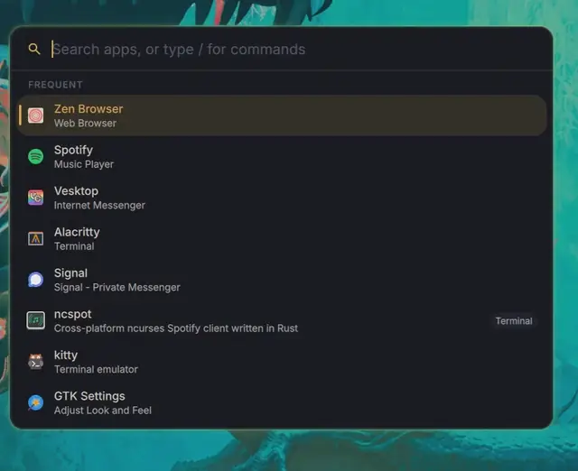

</td>
<td valign="top">

### 🌈 One theme, every app

42 base16 themes in dark and light pairs, or one generated from your wallpaper. It recolors the shell and 23 apps: GTK, Qt, kitty, Neovim, VS Code, Firefox and more.


</td>
</tr>
</table>

See **[all the features](docs/features.md)**, with screenshots of every surface.

## Example setups

> [!NOTE]
> **No file was edited by hand.** Each setup was built with axiom's own editors and Settings page, and ships in [`examples/`](examples). Apply one from **Settings → Maintenance** or with `/config example <name>` in the launcher. It changes the look and layout only (wallpapers, monitors, apps and accounts stay yours), and your current setup is saved first.
>
> Your own setup travels the same way: **Settings → Maintenance → Share** exports its look and layout to a file, leaving out monitors, wallpapers, accounts and paths. **Import…** applies anyone's file just as an example applies. Keybinds, apps and commands come along only if you ask, since a shared command runs as you.

<details>
<summary><b>See all nine</b></summary>

| `clean` | `big-pills` | `powerline` |
| :---: | :---: | :---: |
| 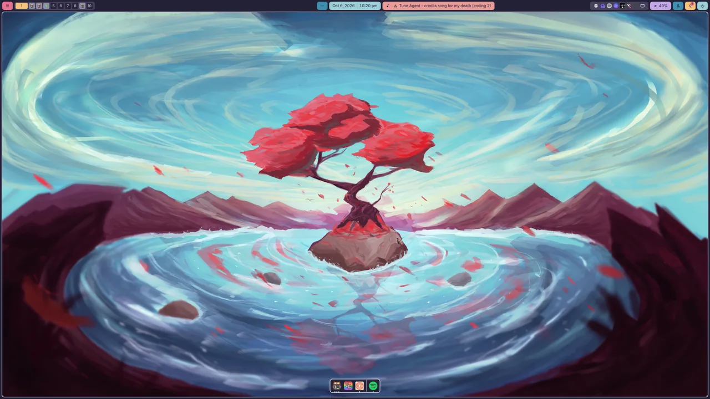 | 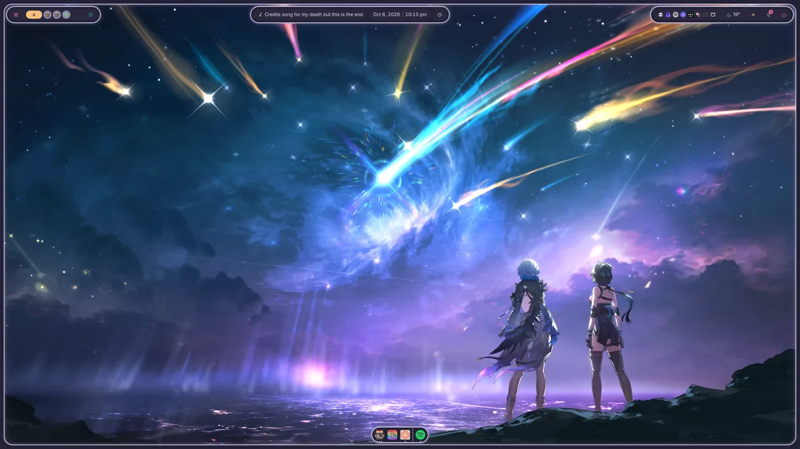 | 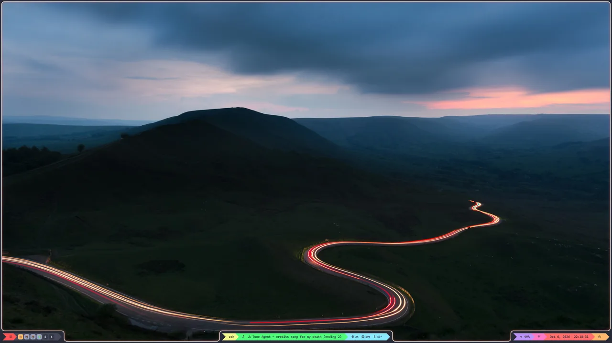 |
| Rosé Pine Moon · solid · filled | Rosé Pine Moon · floating pills · glow | Dracula · bottom pills · powerline |
| **`sidebar`** | **`transparent`** | **`underline`** |
| 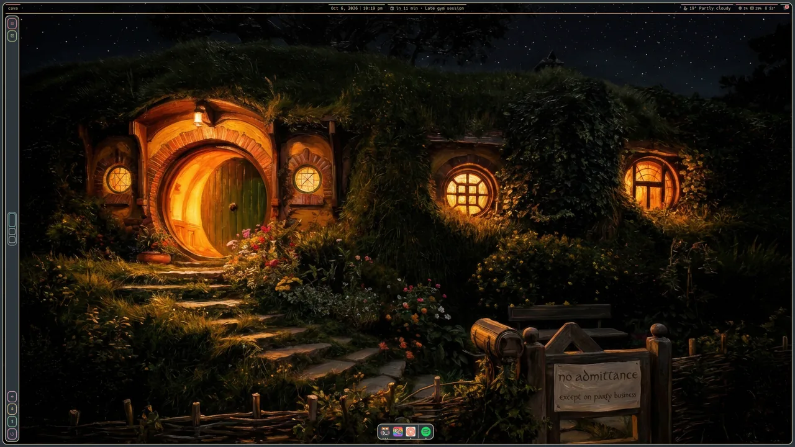 | 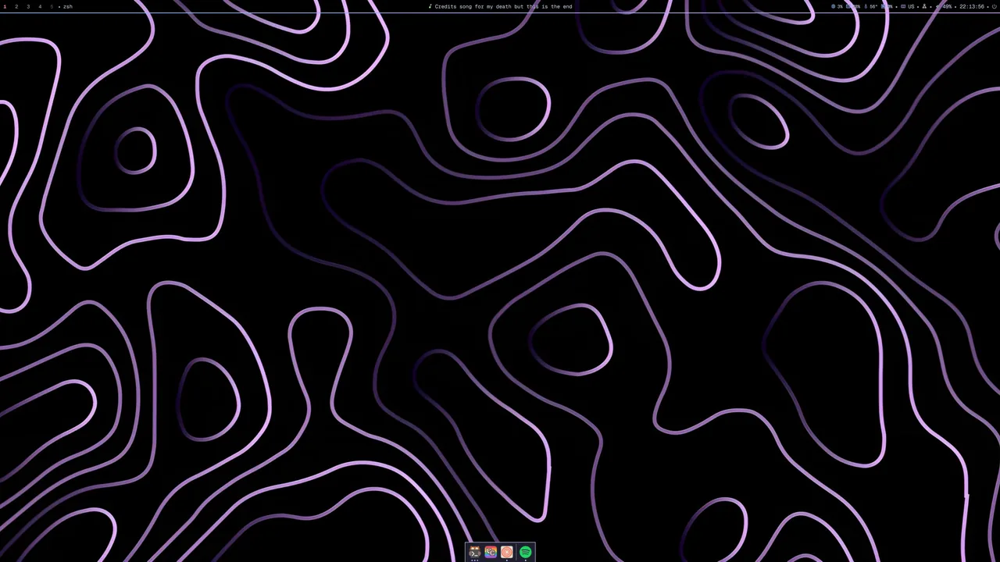 | 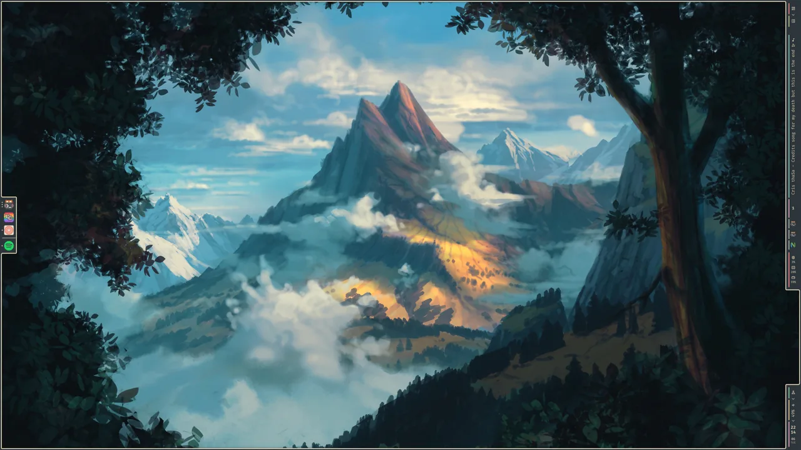 |
| Everforest · floating bar · pinned sidebar | Catppuccin Mocha · transparent · dots | Everforest · right-edge pills · slants |
| **`outline`** | **`basic`** | **`sonar`** |
| 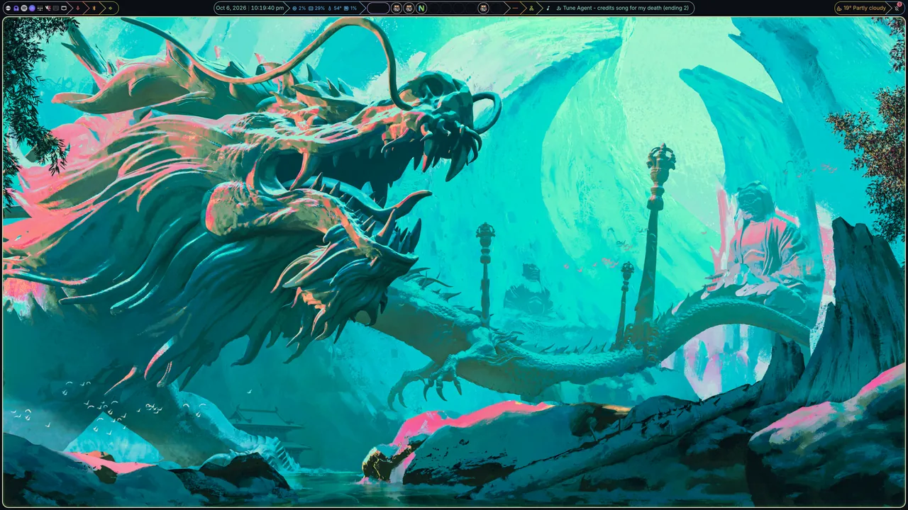 | 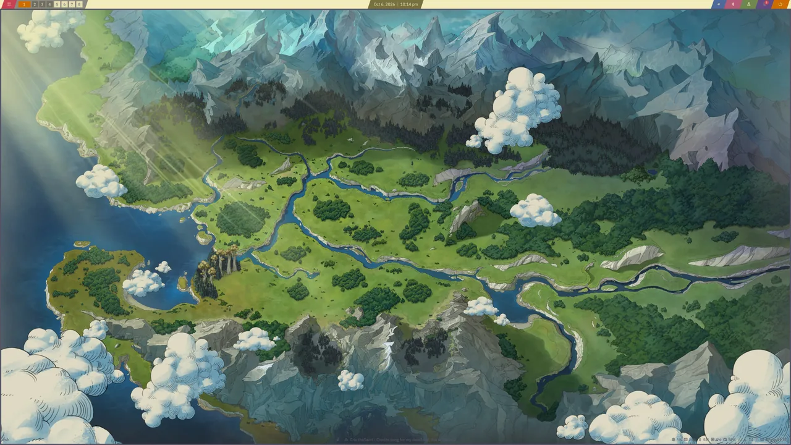 | 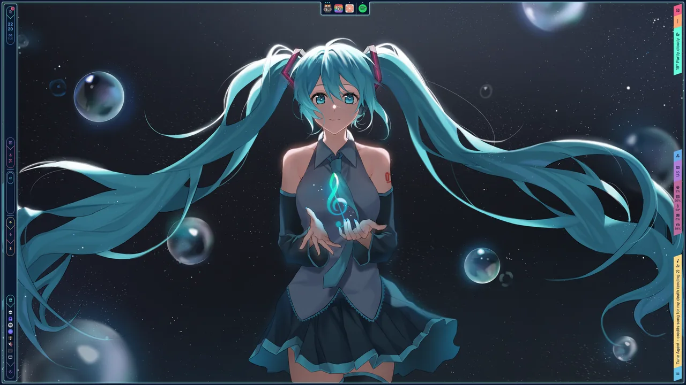 |
| Ayu Dark · outlined arrows · glow | Kanagawa Lotus · two bars · light | Submarine Sonar · both sides · AI chat sidebar |

</details>

## What's included

One repository and one config for the whole desktop:

- **Bars** with 23 widget types, in any style. Their popouts grow out of the bar or the screen border.
- **Overlay** pages built from 27 modules: media, mixer, system graphs, weather, calendar and agenda, notes, AI chat, quick actions and more.
- **Edge menus**, floating over your windows or integrated beside them.
- **Workspaces** as a line, a grid per monitor or scrolling strips, plus a live overview and **Alt+Tab**.
- **Calendar** from CalDAV accounts and `.ics` feeds, with an editor, reminders and quick add (`/event fri 3pm Dentist`).
- **Theming:** 42 base16 themes or ones generated from your wallpaper, applied to 23 other apps, with a light/dark schedule.
- **Launcher** for apps, windows, math, the clipboard, emoji and `/` commands for the whole shell.
- **Lock screen** and **login screen** (greetd), laid out from the same modules, plus a **polkit** prompt.
- **Docks** on any edge with pinning and magnification, **OSDs**, notifications and a power menu.
- **AI chat** (Claude, OpenAI, Gemini or Ollama) in a page, a menu or the launcher.
- A **monitor** layout editor, notes, screenshots and recording, night light, idle, translations, a first-run setup, and **saved configs** you can export, share and import.

## Installation

On Arch Linux, run the installer:

```bash
curl -fsSL https://raw.githubusercontent.com/axiom-dotfiles/axiom/main/install.sh | bash
```

Every package comes from the official repositories. Before running anything, the installer shows the one `sudo pacman` command it will run and why. It asks before adding the line that starts axiom to your `hyprland.lua`, and backs that file up first. On first start, a short setup walks you through the look, monitors, workspaces, apps and integrations.

<details>
<summary><b>By hand</b>: on another distribution, or if you'd rather not pipe to bash</summary>

Install the requirements: [Hyprland](https://hypr.land) 0.55+ with its Lua config, [Quickshell](https://quickshell.org) 0.3.1+, the [Material Symbols](https://fonts.google.com/icons) font, `git`, `jq` and `python3`. Optional features have their own dependencies, listed in [the installation guide](docs/installation.md#requirements).

Then clone into Quickshell's config directory:

```bash
git clone https://github.com/axiom-dotfiles/axiom.git ~/.config/quickshell/axiom
```

Start it with Quickshell:

```bash
qs -c axiom
```

To start it with Hyprland, add this line to your `hyprland.lua` (`-n` keeps a second copy from starting):

```lua
hl.on("hyprland.start", function() hl.exec_cmd("qs -n -c axiom") end)
```

</details>

By default axiom runs in *detached* mode: it applies what it needs at runtime and never writes your Hyprland config. If you'd rather it did, it can also write a file you include, or manage `hyprland.lua` for you (see [Hyprland modes](docs/installation.md#installation)).

## Documentation

- **[Features](docs/features.md):** every surface in detail, with screenshots
- **[Installation and setup](docs/installation.md):** requirements, Hyprland modes, updates, locking, the login screen
- **[Keybinds, IPC and launcher](docs/usage.md):** keybind presets, IPC targets and every launcher command
- **[Configuration](docs/configuration.md):** the config file, backups, themes, translations, troubleshooting
- **[Architecture](docs/architecture.md):** how every service and surface works, for contributors

## Contributing

Contributions are welcome. [Open an issue](https://github.com/axiom-dotfiles/axiom/issues/new/choose) for a bug or an idea, or fork the repository and open a pull request against `main`. CI runs the same checks as `scripts/check_all.sh`.

See [CONTRIBUTING.md](CONTRIBUTING.md) for the layout and conventions, and [docs/architecture.md](docs/architecture.md) for how it all fits together. There's no build step: `qs` interprets the QML and hot-reloads on save.

## Roadmap

- **Other Wayland compositors**, beyond Hyprland
- **More widgets** for bars and overlay pages
- **More styles** for bars, widgets and menus
- **More translations**
- **Performance Improvements**
- **An AUR package**, if there is interest

## Acknowledgments

axiom is built on:
- [Hyprland](https://hypr.land), the compositor it's made for
- [Quickshell](https://quickshell.org), the QML toolkit every surface is written in, and without which axiom couldn't exist
- [Material Symbols](https://fonts.google.com/icons), the icons

The static themes are ports of [Catppuccin](https://catppuccin.com), [Gruvbox](https://github.com/morhetz/gruvbox), [Gruvbox Material](https://github.com/sainnhe/gruvbox-material), [Solarized](https://ethanschoonover.com/solarized/), [Tokyo Night](https://github.com/tokyo-night/tokyo-night-vscode-theme), [Rosé Pine](https://rosepinetheme.com), [Nord](https://www.nordtheme.com) (Nord Light after [threddast's](https://github.com/tinted-theming/schemes/blob/spec-0.11/base16/nord-light.yaml)), [Dracula and Alucard](https://draculatheme.com), [Everforest](https://github.com/sainnhe/everforest), [Kanagawa](https://github.com/rebelot/kanagawa.nvim), [One Dark/Light](https://github.com/atom/atom/tree/master/packages), [Ayu](https://github.com/ayu-theme/ayu-colors), [Nightfox](https://github.com/EdenEast/nightfox.nvim), [GitHub](https://github.com/primer/github-vscode-theme) and [Oxocarbon](https://github.com/nyoom-engineering/oxocarbon.nvim), most by way of [tinted-theming](https://github.com/tinted-theming/schemes)'s base16 palettes. Submarine Sonar is axiom's own.

And thanks to the Hyprland desktops that inspired it: [illogical-impulse](https://github.com/end-4/dots-hyprland), [caelestia-dots](https://github.com/caelestia-dots) and [JaKooLit's Hyprland-Dots](https://github.com/JaKooLit/Hyprland-Dots).

## License

[MIT](LICENSE)
