# Features

[README](../README.md) · [Features](features.md) · [Installation](installation.md) · [Keybinds, IPC and launcher](usage.md) · [Configuration](configuration.md)

The screenshots show [two setups](../README.md#built-in-the-shell) of the same shell. **A** has a pill bar and a transparent bar down the sides of the screen, and **B** has one solid bar across the top, with rounder corners and a thicker border.

## Bar

| A: pill bars on the sides | B: one solid top bar |
| :---: | :---: |
|  | 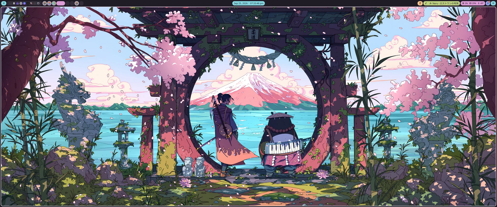 |

- Bars are defined in config. You can have any number, on any monitor and any edge. Each one can be solid, transparent, or split into floating pills.
- 22 widget types: Workspaces, Window, Time, Media, Volume, Microphone, Network, Bluetooth, Battery, SystemStats, SystemTray, Notifications, Updates, Weather, Tailscale, KeyboardLayout, IdleInhibitor, Privacy, ScreenRecord (shown while recording; click to stop), Claude usage (your Claude Code plan limits, for one or more logins), Button (runs any command) and Separator.
- Popouts grow out of the bar, or out of the screen border, with filleted corners. Widgets open theirs on hover:
  - a calendar
  - the audio mixer
  - Bluetooth and Wi-Fi menus
  - live system graphs
  - the forecast
  - pending updates, and more

  Buttons can run their action on hover too, or toggle an [edge menu](#edge-menus).

<b>Popouts</b>

**A:** growing out of the pills, or merging around them

| Calendar | Audio mixer | Forecast |
| :---: | :---: | :---: |
|  |  |  |
| **System graphs** | **Now playing** | **Notifications** |
|  |  |  |
| **Wi-Fi** | **Bluetooth** | **Updates** |
| 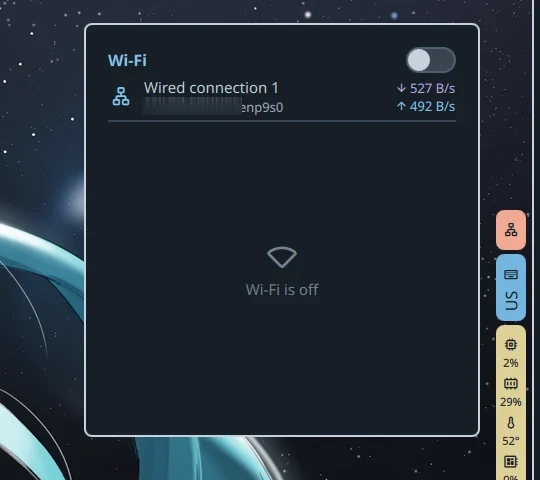 | 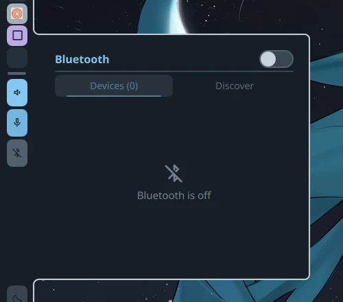 |  |
| **Workspace grid** | | |
|  | | |

**B:** growing out of the top bar, joining the screen border at its end

| Calendar | Now playing |
| :---: | :---: |
| 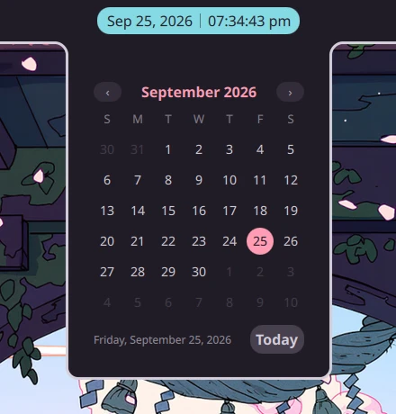 | 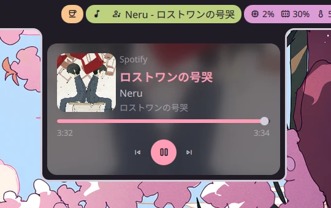 |
| **Notifications** | **System graphs** |
| 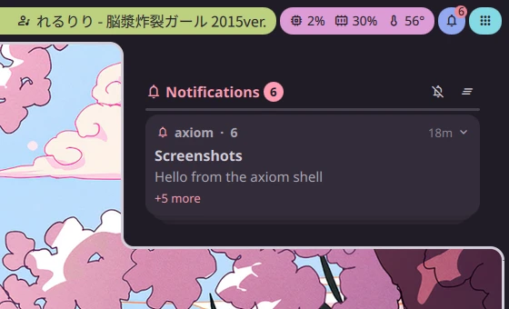 | 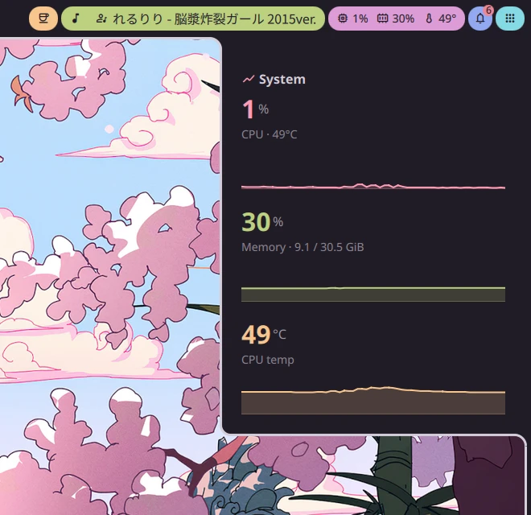 |

## Overlay

| A | B |
| :---: | :---: |
|  | 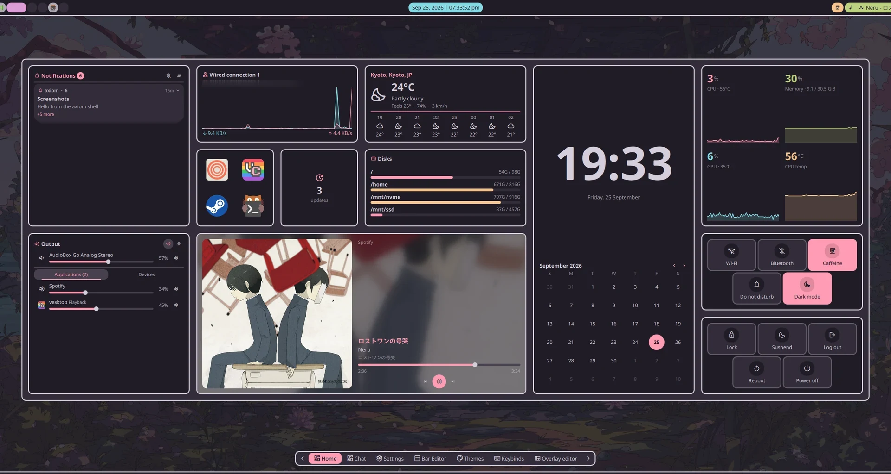 |

- A full-screen overlay made of pages of cards. Each page is a grid you place modules on, sized in quarter cards, with gaps wherever you like.
- 23 modules, including:
  - a media player, audio mixer, system graphs and top processes
  - disks, updates, quick actions (toggles, power, pin), Bluetooth, network and Wi-Fi networks
  - weather, calendar, notes and favorites
  - screenshot, session controls, a workspace map and AI chat
- Modules adapt to their size and shape (square, wide or tall, down to a quarter card).
- Built-in pages:
  - **Settings**, generated from the config schema
  - **Bar editor** and **Layouts** (overlay pages and edge menus, see [Built in the shell](../README.md#built-in-the-shell))
  - **Themes**
  - **Keybinds**
  - **Monitors** (see [The rest](#the-rest))
  - Tool pages sit after your own pages in the navigator, as icons.
- Every module can also go in an [edge menu](#edge-menus).

<b>Built-in pages</b>

| | A | B |
| --- | :---: | :---: |
| **Settings** |  | 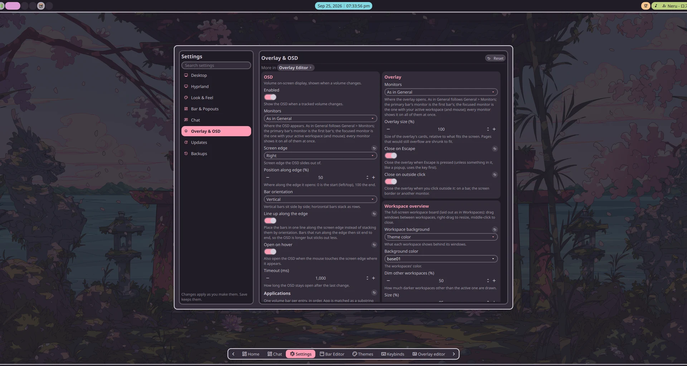 |
| **Keybinds** |  | 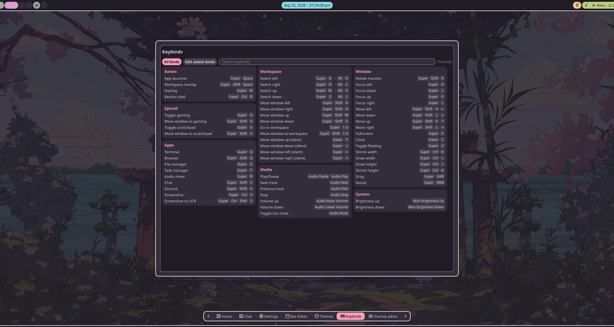 |

## Edge menus

Edge menus are the overlay's other half. Every overlay module fits in them, placed on the same grid, but a menu slides out of a screen edge and leaves the rest of your desktop in view. Use them for what you want one hover away.

- **Floating** menus open over your windows. They grow out of the screen border or a solid bar like the popouts, or sit apart as a box.
- **Integrated** menus open outside the border and bars. They push the bars and your windows inwards, like a sidebar.
- Open one by resting the pointer on its edge, from a bar **Button**, with a keybind, or over IPC (`edgeMenu toggle <id>`). It can close when the pointer leaves or you click outside it, and its pin button or the pin quick action keeps it open. The editor lists what opens a menu and adds a bar button or keybind for it in one click.
- Each menu has its own edge, monitor, position along the edge, length (fit its modules or take the whole edge), card size, padding, colors and hover timings. An integrated menu can also draw a framed box along the whole edge.
- Build them on the **Layouts** page, next to your overlay pages (see [Built in the shell](../README.md#built-in-the-shell)).

An integrated menu takes its space from your windows, which retile beside it and get it back when it closes:

| Closed | Open |
| :---: | :---: |
| 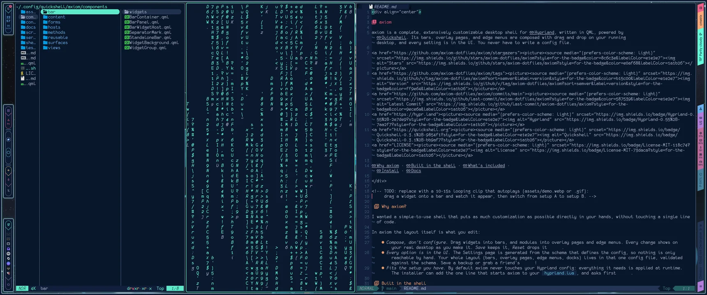 | 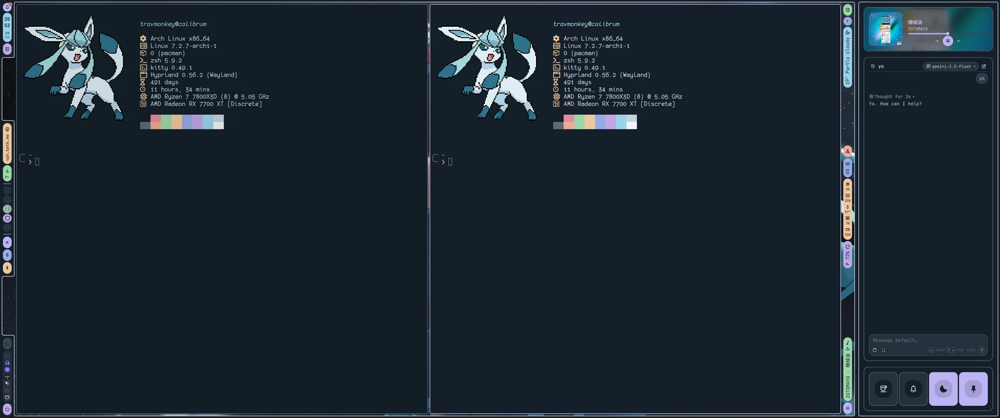 |

Some ideas from setup A:

| Left: controls at hand (floating) | Right: chat beside the bar (integrated) |
| :---: | :---: |
|  |  |
| **Theme menu: wallpaper and theme on hover** | **Notes: a notepad on the top edge** |
|  |  |

And setup B, which keeps it to one menu on the left, under the solid top bar:

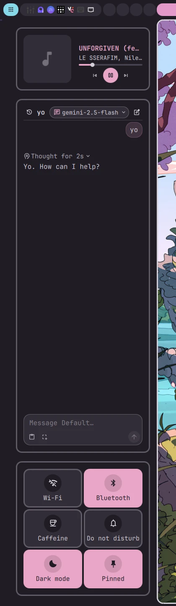

## Dock

| A: growing out of the border at the top | B: floating above the bottom edge |
| :---: | :---: |
|  | 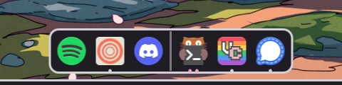 |

- Your pinned apps, then the apps with open windows, grouped by app. A dot or line shows what's running, and a separator splits the two.
- Click to launch or focus an app (clicking again cycles its windows). Right-click for its menu, and drag icons to reorder or pin them, or off the dock to unpin.
- Icons magnify under the pointer, and a tooltip names each app.
- Put any number of docks on any edge and monitor, or on all monitors. They can be always shown, shown on hover, or hidden while a window overlaps them.
- Running apps can count windows everywhere, on the dock's monitor only, or on its workspace only.
- At no gap it grows out of the screen border or a solid bar, just like the popouts. Edit docks under **Settings → Dock**.

## Theming

| | Dark | Light |
| --- | :---: | :---: |
| **A** |  |  |
| **B** | 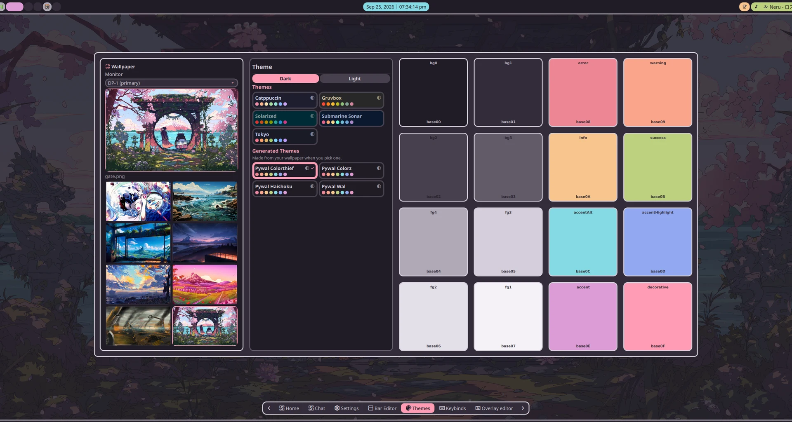 | 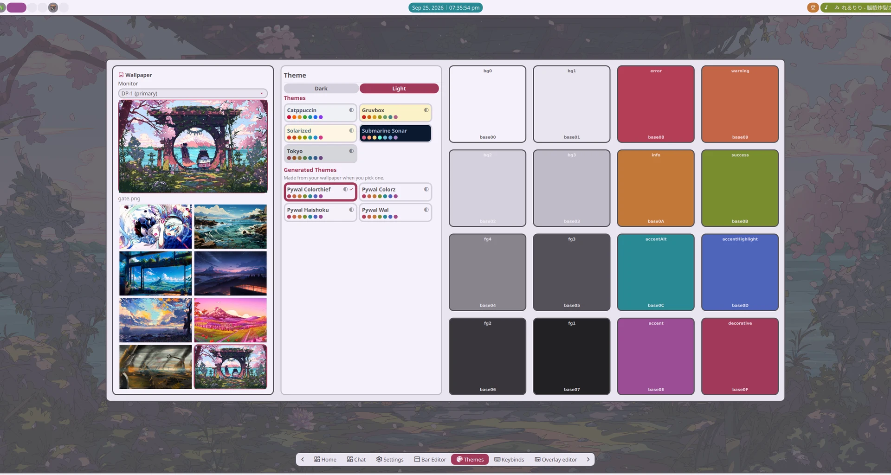 |

- Base16 themes, with dark and light pairs switched by one toggle: Catppuccin, Gruvbox, Solarized, Tokyo Night/Day and Submarine Sonar.
- Generate themes from your wallpaper, in five styles (tonal, vibrant, faithful, muted, alternate). The palette is built in OKLCH from the image's main colors, to match the contrast of the hand-made themes.
- Wallpapers can be set per monitor. Axiom draws them itself (crossfading), or through [awww](https://github.com/LGFae/awww) for its transitions (`Appearance.wallpaperBackend`).
- The active theme is applied to other apps too. Each app is a switch under **Settings → Theme integrations**, gets its own `axiom` theme file, and its switch's description gives the one line to add to its config. Your own config files are never edited.

<b>Supported apps (18)</b>

| Kind | Apps |
| --- | --- |
| Toolkits | GTK, Qt |
| Terminals | kitty, Alacritty, foot, WezTerm, Ghostty |
| Editors | Neovim, Helix, VS Code |
| CLI tools | k9s, cava, btop, fzf, lazygit, bat/delta, Yazi |
| Lockscreen | hyprlock |

## The rest
- **Notifications:** toasts and a notification center. Toasts stack from any corner of one monitor or all of them, with even or per-side gaps measured from the bar or border at each edge. You can set how long they stay (or use the app's own timeout), keep critical ones up, and keep them quiet over fullscreen windows. The history can drop an app's notifications when you focus it, or when you click or close them, and has a size and age limit. Do not disturb is kept across restarts.
- **OSD:** as many as you like, each on an edge or floating anywhere, holding the bars you pick: output and microphone volume, brightness, the volume of the apps you choose, or of every other app.
- **Launcher:** searches apps (ranked by how often and how recently you use them), open windows, a calculator, the web, your clipboard history and emoji. It runs shell commands and controls the shell with `/` commands.
- **Power menu:** your choice of session actions, in your order, driven by mouse or keyboard. Log out, reboot and power off ask you to confirm.
- **Workspaces:** laid out as 1 to N, or as a grid per monitor (5×5 by default) that you move around by row and column. The bar widget, the workspace map, the workspace overview and your keybinds (through the `workspaces` IPC target) all follow the one setting.
- **Workspace overview:** live window previews. Drag a window onto a side of another window or onto another workspace, right-drag to resize it, and middle-click to close it.
- **AI chat:** Anthropic, OpenAI, Gemini, or anything with an OpenAI-style API (Ollama, LM Studio, OpenRouter, …). Replies stream in as formatted Markdown with copyable code blocks and folded thinking. Also: saved conversations, presets (system prompt, model, effort), image attachments (paste, screenshot a region, drop) and `@` in the launcher to ask a question. API keys come from environment variables, your keyring or a mode-600 secrets file, never `config.json`.
- **Lockscreen:** three modes: the built-in `ext-session-lock` locker (PAM), a themed hyprlock config that axiom generates, or none. The built-in one is laid out on the Layouts page like an overlay page: a greeting, the password field, a clock, media, weather and other display-only modules anywhere on a screen-sized grid, over your wallpaper (blurred and dimmed) or a color, with a preview on screen.
- **Monitors:** a page to arrange monitors by dragging (they snap edge to edge) and set each one's mode, scale, rotation, mirroring, VRR, bit depth and color management. One layout is kept per set of connected monitors and switches on its own when you plug one in. **Apply** asks you to keep the change, and puts the old layout back after 15 seconds if you don't.
- **Multi-monitor:** interactive surfaces open on the primary monitor, on whichever monitor has focus, or on all of them at once.
- **First-run setup:** a guided tour through the look, monitors, workspaces, default apps, Hyprland's mode and the optional integrations, applied as you go. `/welcome` runs it again.
- **Notes:** Markdown files in a folder you choose, edited in place with task checkboxes. A note open in two places stays in sync, and `/notes` in the launcher searches them all.
- **Screenshots:** a region, a window or a whole screen, picked on a frozen frame. Saved and copied, or opened in satty or swappy to annotate. Also screen recording with `wf-recorder`.
- **Brightness:** keys and an OSD bar for a laptop screen and for external monitors over DDC/CI.
- **Night light:** warmer colors on a schedule, through `hyprsunset` or `wlsunset`.
- **Idle:** axiom can run hypridle from its own settings: dim, lock, screen off and suspend timeouts.
- **Wallpapers:** fixed, rotating on a timer, or one for light mode and one for dark. Light and dark themes can also switch on a schedule.
- **Translations:** English and Japanese, with more added as a single JSON file each.

<b>Screenshots</b>

| | A | B |
| --- | :---: | :---: |
| **Workspace overview** |  | 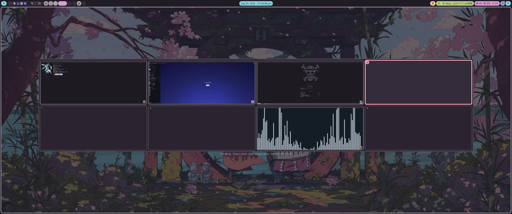 |
| **AI chat** |  | 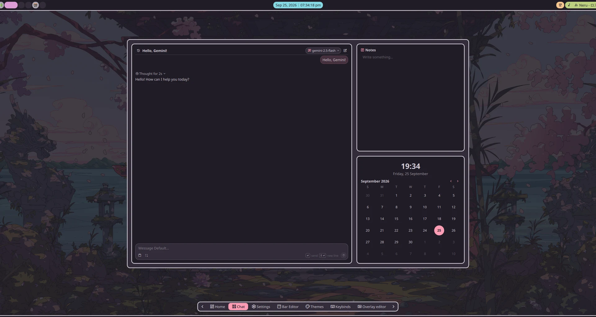 |
| **Power menu** |  | 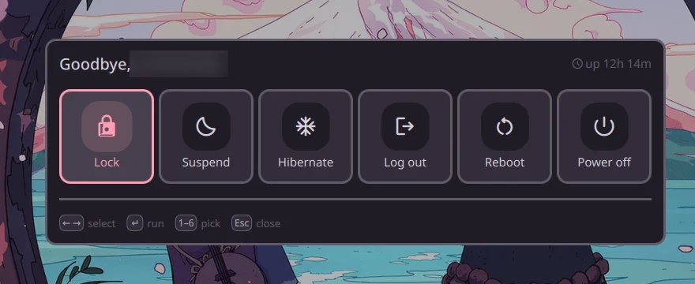 |
| **Notification** |  | 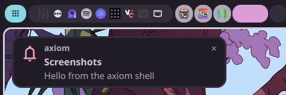 |
| **OSD** |  | 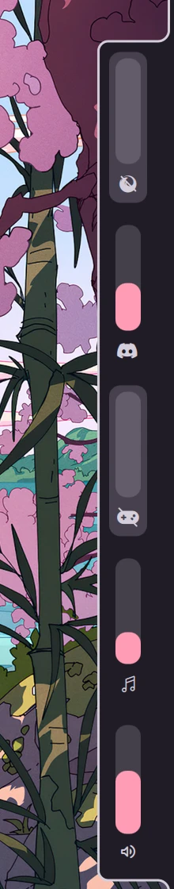 |
| **Monitors** |  | |

