# Features

[README](../README.md) · [Features](features.md) · [Installation](installation.md) · [Keybinds, IPC and launcher](usage.md) · [Configuration](configuration.md)

Everything below is one shell and one config, and everything is set from inside the shell. The screenshots come from the [example setups](configuration.md#example-setups), each built entirely with axiom's editors, so the look changes from one to the next.

**On this page:** [Bar](#bar) · [Bar styles](#bar-styles) · [Overlay](#overlay) · [Layouts editor](#the-layouts-editor) · [Edge menus](#edge-menus) · [Workspaces](#workspaces) · [Window switcher](#window-switcher-alttab) · [Calendar](#calendar) · [Launcher](#launcher) · [Dock and OSD](#dock-and-osd) · [Lock screen, login screen and polkit](#lock-screen-login-screen-and-polkit) · [Theming](#theming) · [The rest](#the-rest)

## Bar

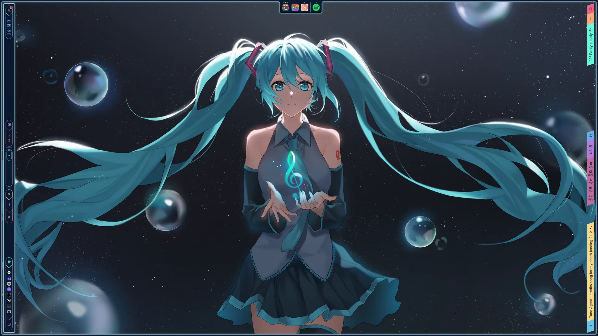

- Bars are defined in config. Have any number, on any monitor (or a copy on every one) and any edge.
- **23 widget types:**
  - Workspaces, Window, Time, NextEvent (the next event from your calendars), Media
  - Volume, Microphone, Network, Bluetooth, Battery, SystemStats, SystemTray, Notifications
  - Updates, Weather, Tailscale, KeyboardLayout, IdleInhibitor, Privacy
  - ScreenRecord (shown while recording; click to stop), Claude usage (your Claude Code plan limits, for one or more logins)
  - Button (runs any command, opens a page or toggles an edge menu) and Separator
- **Popouts** grow out of the bar, or out of the screen border, with filleted corners. Widgets open theirs on hover, and Buttons can run their action on hover too.
- **The bar editor** draws each bar's sections the way the bar lays them out, on the side of the page matching the bar's edge:
  - Drag widgets in from the library, click one to edit it, and drop one on the trash can to remove it.
  - A full section scrolls.
  - It tells you, per screen, which widgets don't fit.
  - **Copy style** puts one bar's look onto others.

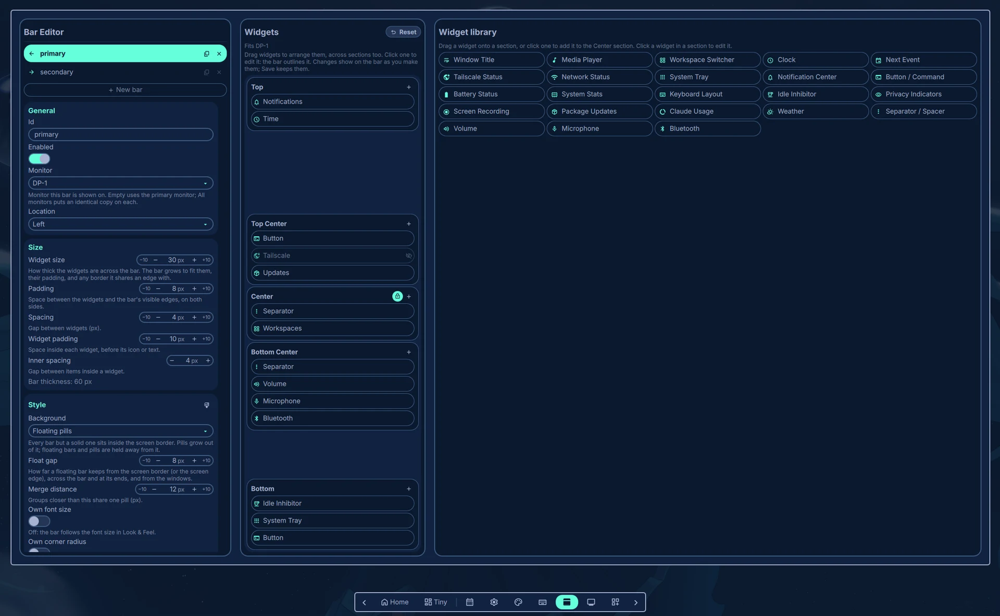

<b>Popouts</b>

| Calendar | Audio mixer | Notifications |
| :---: | :---: | :---: |
| 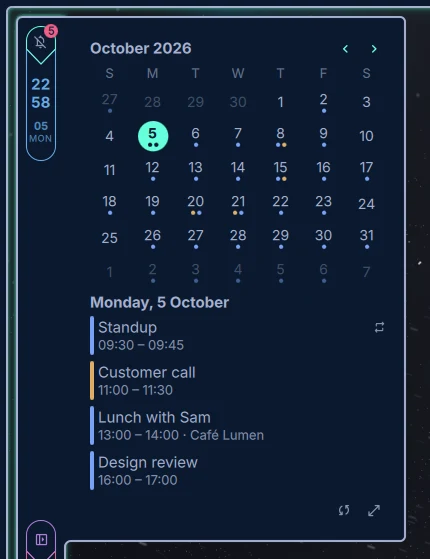 | 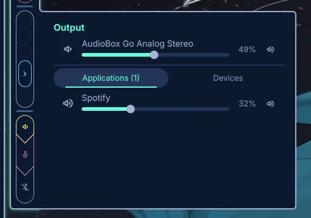 | 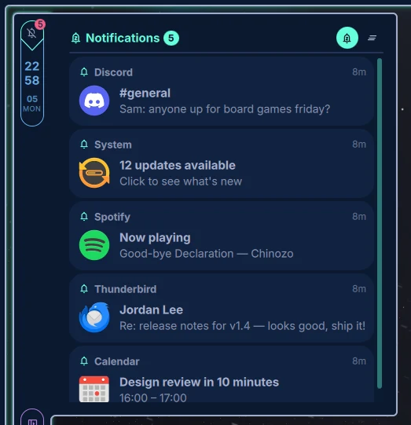 |
| **Now playing** | **System graphs** | **Forecast** |
| 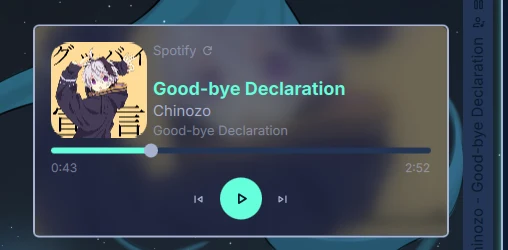 | 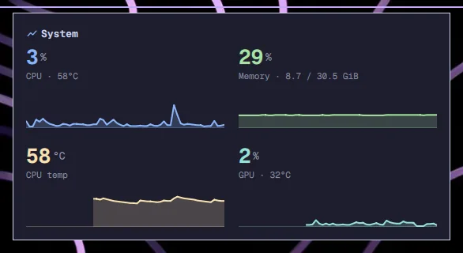 | 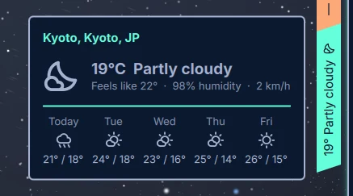 |
| **Updates** | **Workspace grid** | |
| 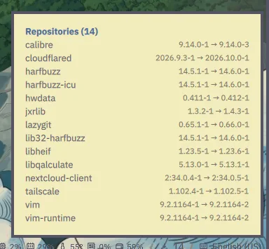 | 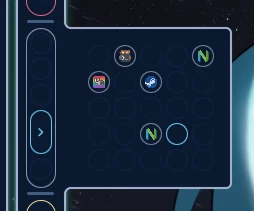 | |

### Bar styles

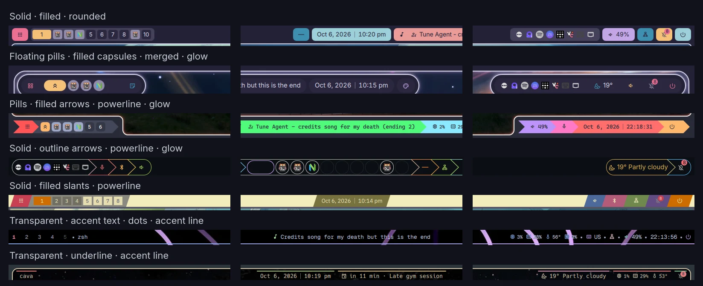

Set a style once under **Settings → Look & Feel → Bar widgets**, and give any bar its own:

| | Options |
| --- | --- |
| **Background** (per bar) | solid, transparent, pills (a pill per group of widgets), floating (one bar held off the edge), floating pills |
| **Widget style** | filled, tinted, outline, underline, coloured icons, plain |
| **Shape** | rounded, capsule, slant, arrow |
| **Grouping** | separate, merged (neighbours share one background), powerline (each shape runs into the next) |
| **Ends** | shaped, pointed, rounded |
| **Separators** | none, line, dot, slash, chevron |
| **Accent line** | none, inner or outer edge, with an optional fade to a second color |
| **Shadow** | none, shadow, glow |

- **Widget colors** default to **Auto**: the bar gives neighbouring widgets different accents and keeps the contrast readable. Pick a theme color for any of them instead.
- A bar can override the shared widget style, accents, shadow, font size and corner radius.
- Floating bars and pills have their own gap, and nearby pills can merge into one.
- **Translucency** (**Settings → Look & Feel → Translucency**): one opacity for every surface (bars, the screen border, popouts, menus, panels), down to 60%, with Hyprland blurring behind it. The blur is Hyprland's own: set it from axiom under **Hyprland → Window look → Blur** (size, passes, noise, …, and whether windows blur too), where window opacity lives as well, and both travel with exported and imported configs. The backdrops behind the overlay, launcher and power menu can frost the whole screen.

## Overlay

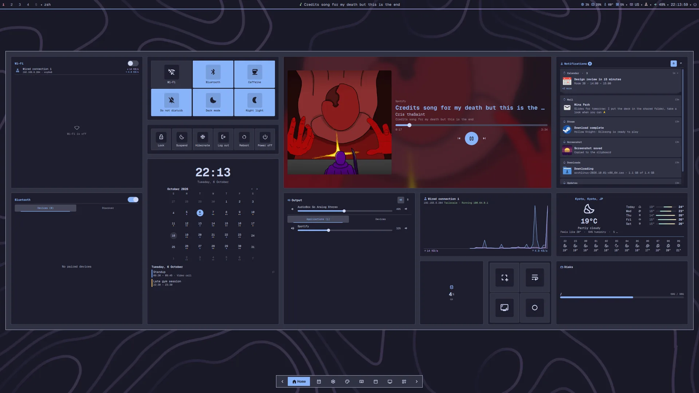

- A full-screen overlay made of pages. Each page is a grid you place modules on, with gaps wherever you like. Pages have their own name and icon in the navigator.
- **36 modules**, and every one adapts to its size and shape (square, wide or tall, down to a compact figure):

  | Group | Modules |
  | --- | --- |
  | Media and sound | Now playing, Audio mixer, Volume dials |
  | System | System graphs, Top processes, Disks, Battery, Updates, Network |
  | Controls | Quick actions (toggles, power, pin), Screenshot, Screen recording (region or screen, with sound, recent recordings), Night light, Bluetooth devices, Wi-Fi networks, Favourite apps |
  | Time and plans | Clock (digital, stacked or analog, in any time zone), World clocks, Clock & calendar, Calendar, Agenda, Weather |
  | Workspace | Workspaces map, Notifications |
  | Writing | Notes, AI chat |
  | Utilities | Calculator (with a keypad; math, units and currencies), Clipboard history (with pins), Emoji picker, Command output (any command's output as a card), Keybind cheat sheet |
  | Look | Theme picker, Wallpapers, Palette, Theme color swatch, Greeting |

- **Built-in pages:**
  - **Settings**, generated from the config schema
  - **Bar editor** and **Layouts** (see [the Layouts editor](#the-layouts-editor))
  - **Themes**, **Keybinds**, **Monitors** and **Calendar**

  Tool pages sit after your own in the navigator, as icons, and any of them can be hidden.
- Every page has an opener: a bar button or a keybind that opens the overlay on it, added from the editor in one click.

<b>Built-in pages</b>

| Settings | Keybinds |
| :---: | :---: |
| 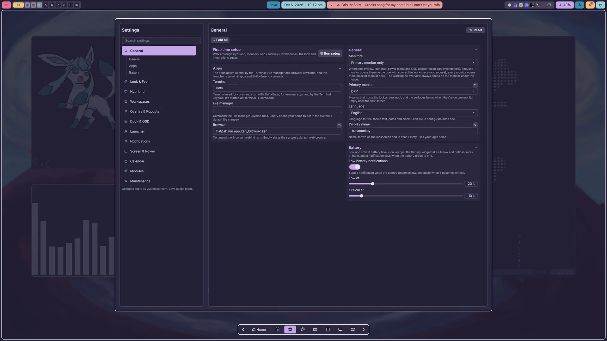 | 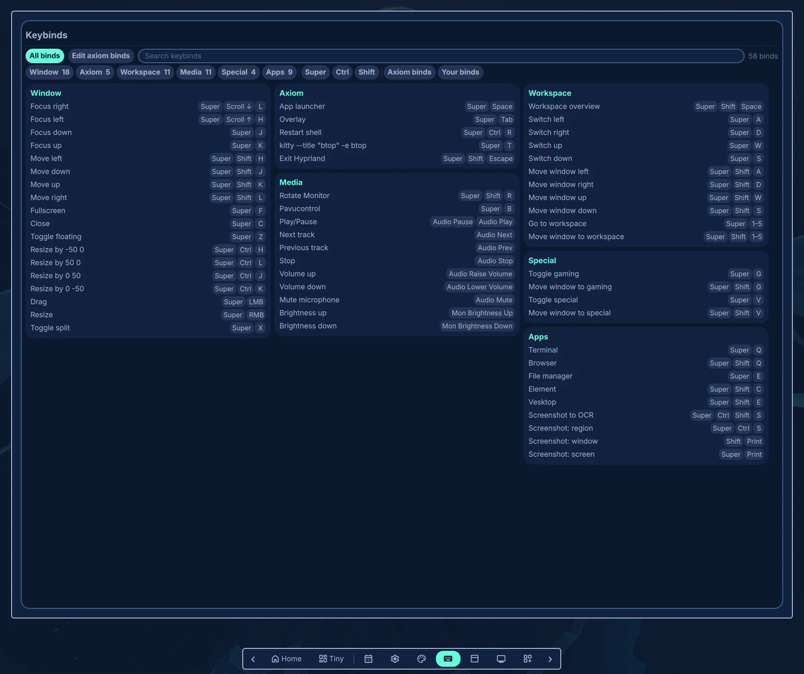 |
| **Look & Feel** | **Monitors** |
| 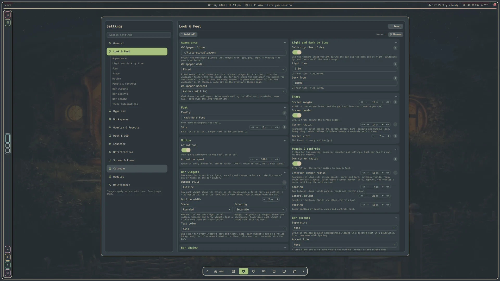 | 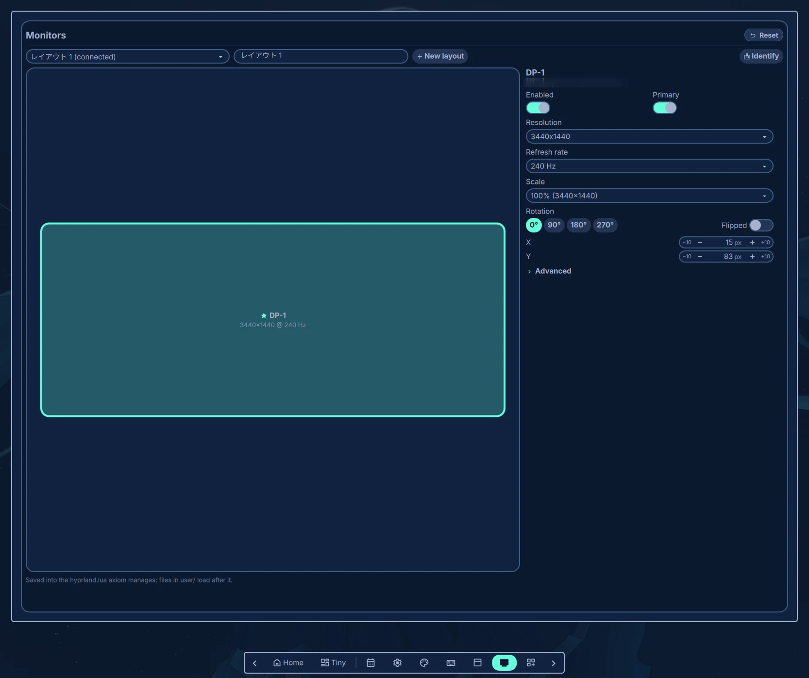 |

## The Layouts editor

One editor, one grid, for everything made of modules: your **overlay pages**, your **edge menus**, the **desktop**, the **lock screen** and the **login screen**.

| A page | An edge menu |
| :---: | :---: |
| 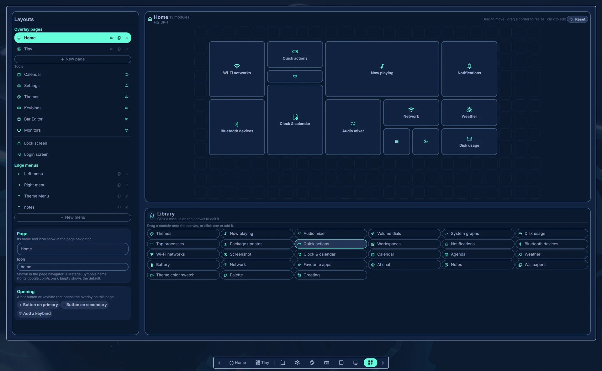 | 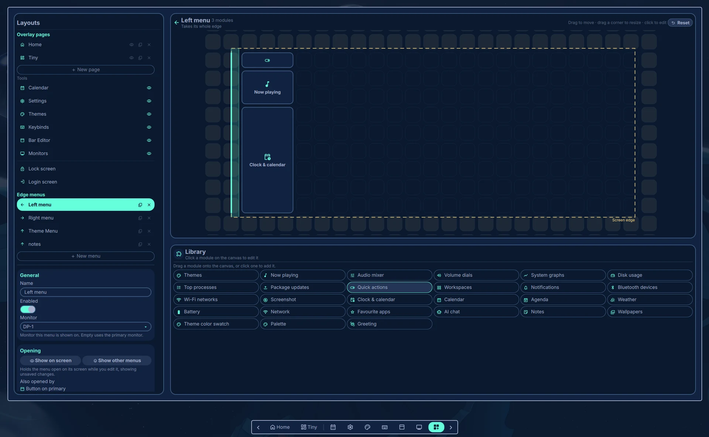 |
| **The lock screen** | **The login screen** |
| 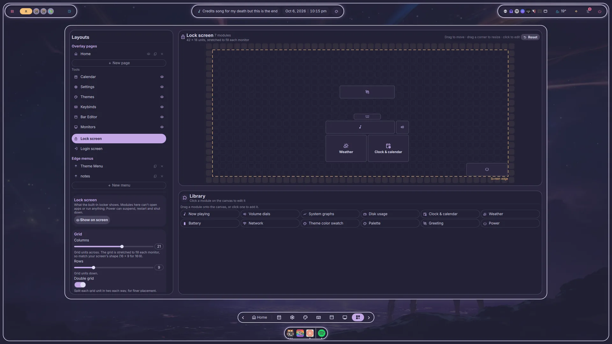 | 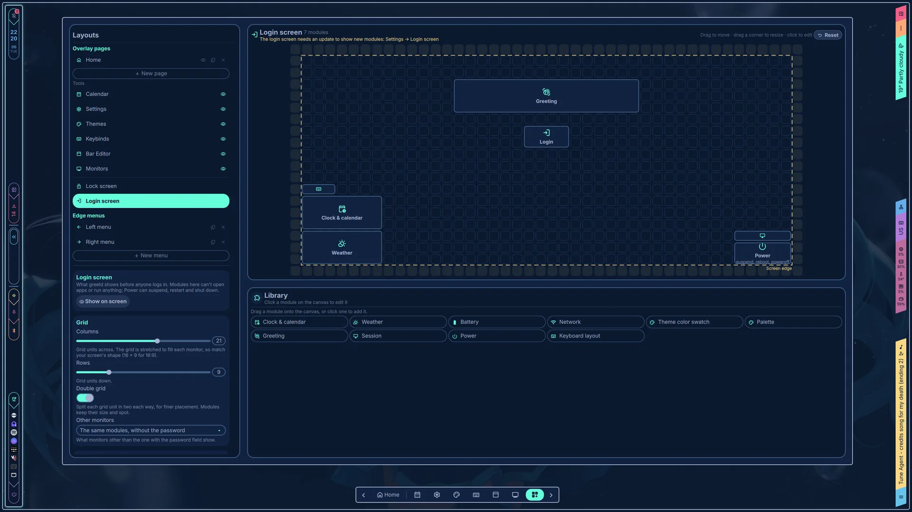 |

- Drag a module from the library onto the grid (or click it to drop it in the first free spot): dropped into a gap it shrinks to fit, dropped onto other modules it pushes them aside (down a page, along an edge menu's edge), and you see where everything will go before you let go. Drag a module anywhere, and drag any edge or corner to resize it.
- Drag a box (or Shift/Ctrl+click) to select several modules and move them together, or drop them on the trash can to remove them.
- Undo and redo every edit (buttons, or Ctrl+Z / Ctrl+Shift+Z), and move or resize the selected module with the arrow keys (Shift to resize).
- Click a module to edit its options in the inspector, which also has steppers for its exact size.
- Edge menus are drawn against their screen edge. The desktop and the lock and login screens are a screen-sized grid, with an optional double grid for finer placement.
- **Desktop widgets:** modules on your desktop, under your windows, fitted inside the bars and border so they line up with your tiled windows. They sit straight on the wallpaper (or in frosted cards) and take clicks, while the empty desktop is clicked through. One layout can cover all monitors, the primary monitor, or a monitor of its own (by name, so a laptop's screen keeps its layout when you dock and undock).
- Every change shows live on your desktop (or on screen, for the lock and login screens, with **Show on screen**). **Save** keeps it, **Reset** throws it away.
- Each page and menu lists what opens it, and adds a bar button or a keybind for it.

## Edge menus

Edge menus are the overlay's other half. Every overlay module fits in them, placed on the same grid, but a menu slides out of a screen edge and leaves the rest of your desktop in view. Use them for what you want one hover away.

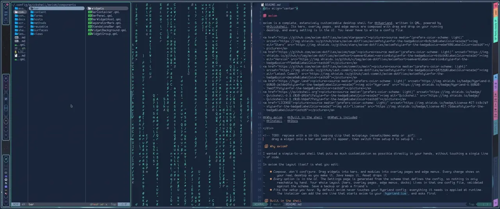

- **Floating** menus open over your windows. They grow out of the screen border or a solid bar like the popouts, or sit apart as a box.
- **Integrated** menus open outside the border and bars. They push the bars and your windows inwards, like a sidebar, and give the space back when they close.
- **Opening a menu.** Rest the pointer on its edge, or use a bar **Button**, a keybind, or IPC (`edgeMenu toggle <id>`).
- **Closing it.** A menu can close when the pointer leaves or when you click outside it. Its pin button, or the pin quick action, keeps it open.
- **Per-menu settings.** Each menu has its own:
  - edge, monitor and position along the edge
  - length: fit its modules, or take the whole edge
  - card size, padding and colors
  - hover timings

  An integrated menu can also draw a framed box along the whole edge.

| Left: media at hand (floating) | Right: chat beside the bar (integrated) | Right: the week ahead (integrated) |
| :---: | :---: | :---: |
| 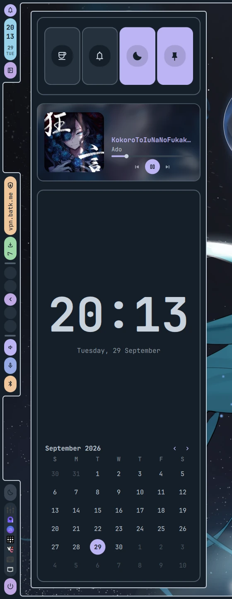 | 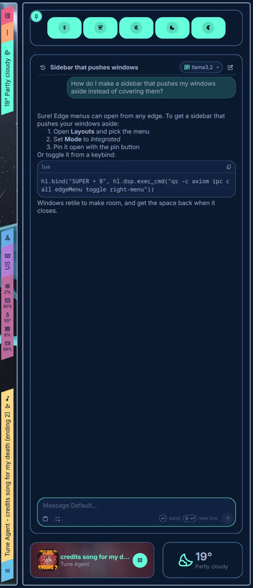 | 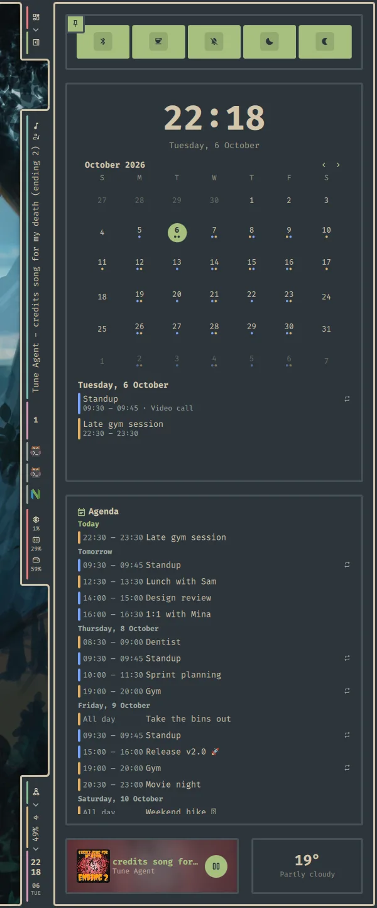 |
| **Top: wallpaper and theme, dropping from a pill** | **Right: a notepad** | |
| 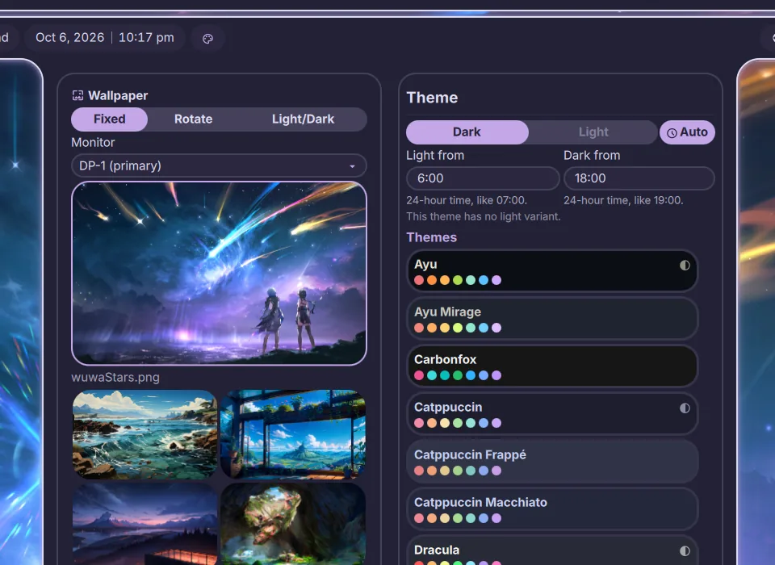 | 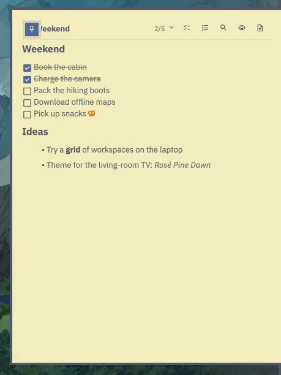 | |

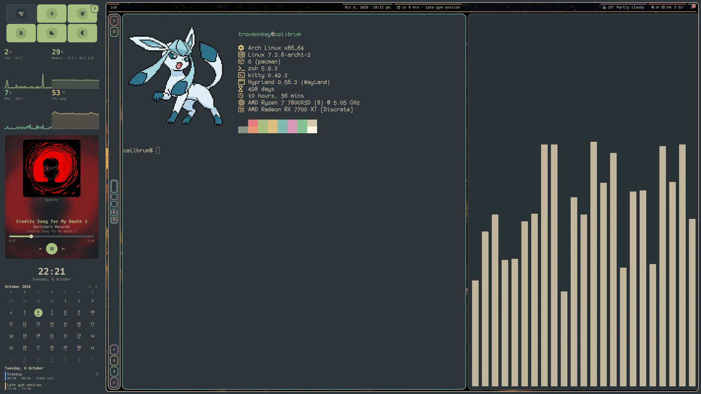

## Workspaces

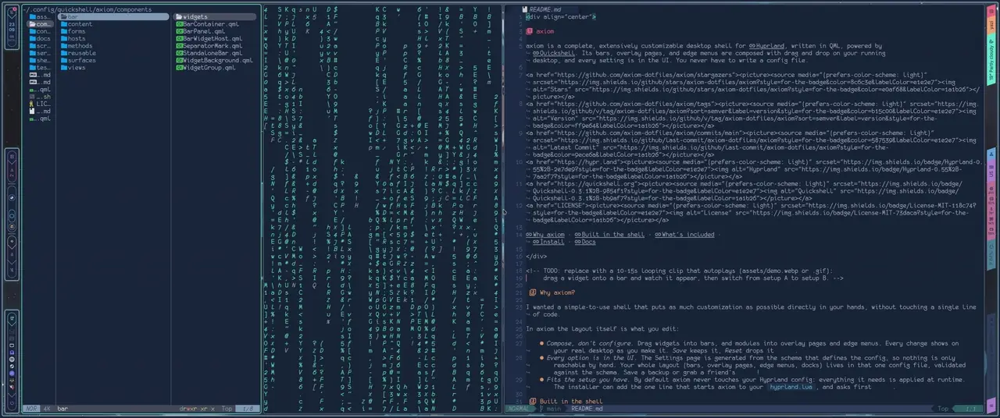

Set **Settings → Workspaces → Layout**:
- **Standard:** 1 to N, shared by every monitor.
- **Per monitor:** each monitor gets its own block of N.
- **Grid per monitor:** each monitor gets a grid (5×5 by default, up to 10×10) that you move around by row and column. Moving left or right slides sideways, and up or down slides vertically, whatever Hyprland's own workspace animation is set to.

Then:
- **One setting, everywhere.** The bar widget, its popout, the workspace overview, the Workspaces module, the launcher's `/ws` and the `workspaces` IPC target all follow the layout.
- **A stable order.** The primary monitor comes first, so plugging one in or restarting Hyprland never reshuffles which workspaces belong to which monitor. Changing the layout moves your windows to the matching place in the new one.
- **Scrolling strips.** Make any monitor (or every one) a strip, Hyprland's scrolling layout, horizontal or vertical:
  - The bar shows the active workspace's windows in strip order, and its popout lists every workspace with its windows.
  - The mouse wheel scrolls the strip.
  - The overview shows the whole strip, off-screen columns included.
  - The **Strips** keybind preset adds swapping columns, resizing them and fitting the visible ones.
- **The overview** shows live window previews. Drag a window onto another workspace or onto a side of another window, right-drag to resize it, and middle-click to close it.
- **Keybinds included.** Presets for the grid with WASD or the arrows (add <kbd>Shift</kbd> to take the window along), or previous and next.

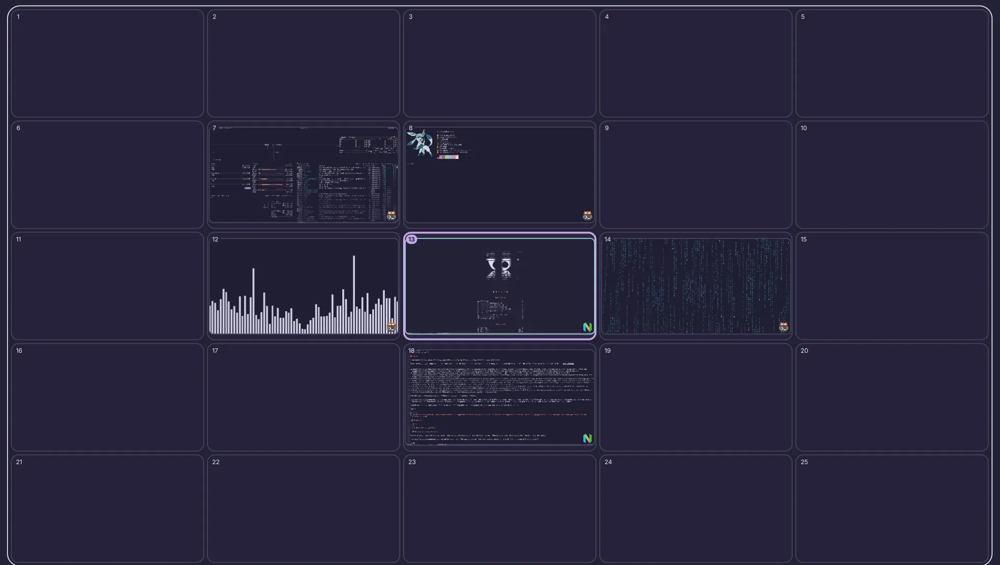

## Window switcher (Alt+Tab)

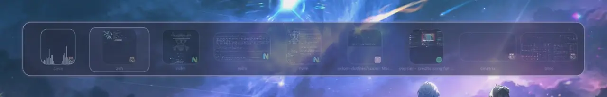

- <kbd>Alt</kbd>+<kbd>Tab</kbd> and <kbd>Alt</kbd>+<kbd>Shift</kbd>+<kbd>Tab</kbd> step through your windows, most recently used first, on the focused monitor. Let go of <kbd>Alt</kbd> to switch, press <kbd>Esc</kbd> to stay, or click a tile.
- It only appears once you've held the keys for a moment, so a quick tap just swaps to your last window without anything drawn.
- Show windows from everywhere, from this monitor only, or from this workspace only, as live previews or app icons, at the tile size you like (**Settings → Workspaces → Window switcher**).
- Hyprland holds the keys, so it never misses a fast release. It's on the Keybinds page as a preset, and on any other combination you like.

## Calendar

| The Calendar page | In the bar |
| :---: | :---: |
| 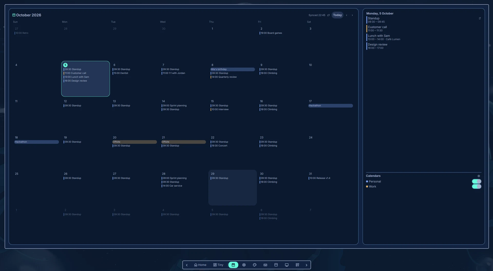 |  |

- **Sources:** your calendars from **CalDAV** accounts (iCloud, Fastmail, Nextcloud or any CalDAV server), and read-only **.ics subscriptions** (holidays, shared feeds, Google's secret iCal address).
  - Add accounts in **Settings → Calendar**, then pick which of an account's calendars show.
  - Give any calendar a theme color in place of the server's.
  - Passwords go to your keyring, never into the config.
- **Days with events** get a dot per calendar, in the calendar popout, the **Calendar** and **Clock & calendar** modules, and the **Calendar** page.
  - Click a day to see its events, and an event to edit it.
  - Recurring events ask whether a change is for that one or all of them.
  - The **Clock & calendar** module lists the day's events where they fit. It can also show them on the lock screen, read-only.
- **The Calendar page** shows the month large, with the events in it, and switches calendars on and off.
- An **Agenda** module lists what's coming up, and the **NextEvent** bar widget shows the next event ("in 10 min · Standup").
- **Reminders** from your events show as notifications.
- **Quick add** from the launcher: `/event tomorrow 3pm Dentist`, `/event fri 9-10:30 Planning`, `/event 2026-12-24 all day Holiday`.
- **Syncing:** it syncs every few minutes while something shows a calendar (or reminders are on), and keeps a copy on disk, so it shows at once and works offline. Events never show on the login screen.

## Launcher

| Apps | Commands | Calculator | Emoji |
| :---: | :---: | :---: | :---: |
| 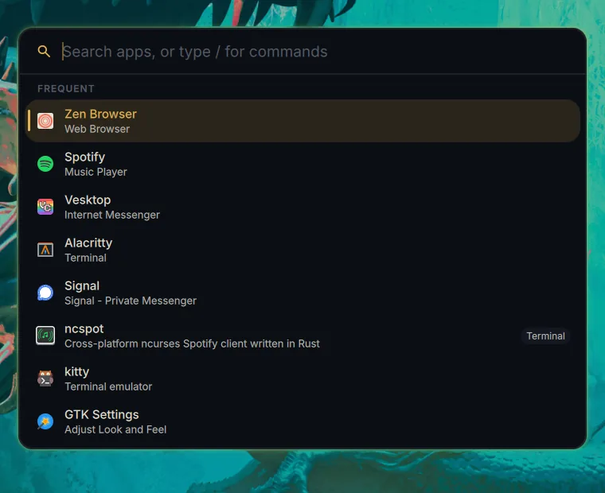 | 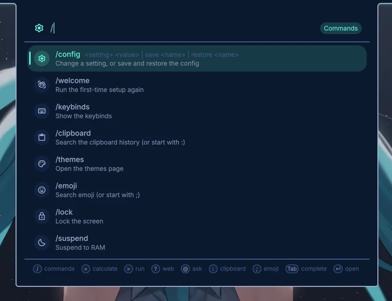 | 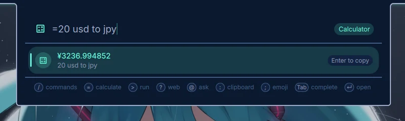 | 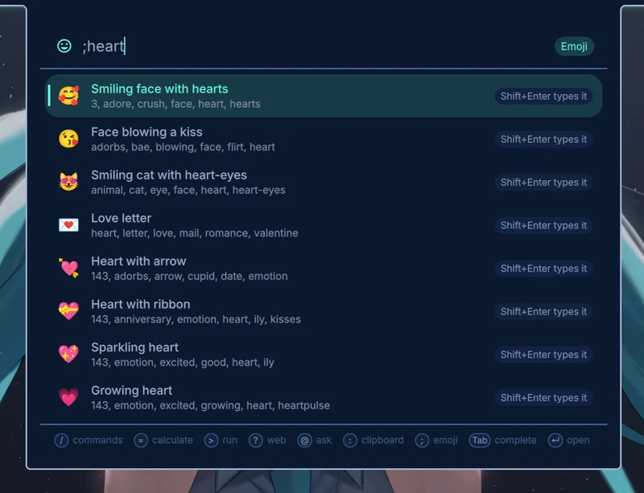 |

- **Search:** apps (ranked by how often and how recently you use them), open windows, a calculator (math, units, currencies), the web, your clipboard history and emoji.
- **Commands:** it runs shell commands, asks your AI chat, and controls the whole shell with `/` commands. Commands that change something you can see (the theme, the volume, the wallpaper) keep the launcher open, so you can try several.
- **Placement:** floating, centred or in the upper third, or attached to the top or bottom edge like the other edge popouts. The field can sit above or below the results.

Every prefix and command is listed in [Keybinds, IPC and launcher](usage.md#launcher).

## Dock and OSD

| Dock | OSD (a column of bars) | OSD (a row of bars) |
| :---: | :---: | :---: |
| 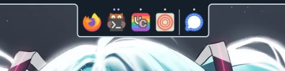 | 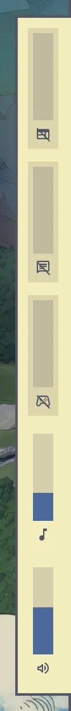 | 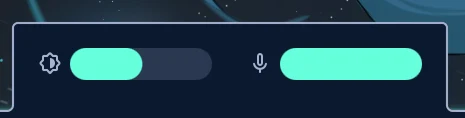 |

**Dock:**
- **Contents:** your pinned apps, then the apps with open windows, grouped by app. A dot or line shows what's running, and a separator splits the two.
- **Using it:**
  - Click to launch or focus an app; clicking again cycles its windows.
  - Right-click for the app's menu.
  - Drag icons to reorder or pin them, or off the dock to unpin.
  - Icons magnify under the pointer, and a tooltip names each app.
- **Visibility:** always shown, shown on hover, or hidden while a window overlaps it. Running apps can count windows everywhere, on the dock's monitor only, or on its workspace only.

**OSD:**
- **Bars:** each OSD holds the bars you pick: output and microphone volume, brightness, the volume of the apps you choose, or of every other app. A change opens every OSD holding that bar.
- **Layout:** it can open on hover too, and lay its bars along the edge or across it.

**Both:**
- **Placement:** have any number, on any edge, at any position along it. Put them on a named monitor, the primary, the focused one (following focus) or every monitor.
- **Edges:** at no gap they grow out of the screen border or a solid bar, like the popouts. Held off the edge, *Auto* lines them up with a floating bar.
- **Sharing an edge:** a dock gives way to an OSD, and both give way to a floating edge menu opened on their edge.
- Edit them under **Settings → Dock & OSD**.

## Lock screen, login screen and polkit

| Lock screen | Login screen |
| :---: | :---: |
| 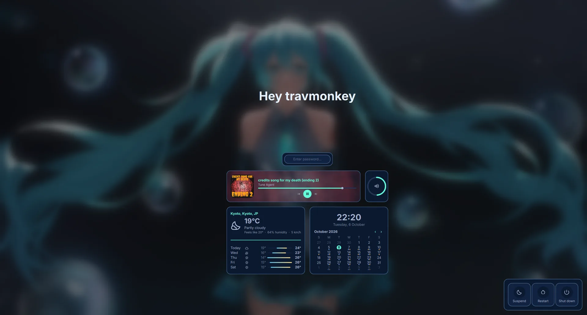 | 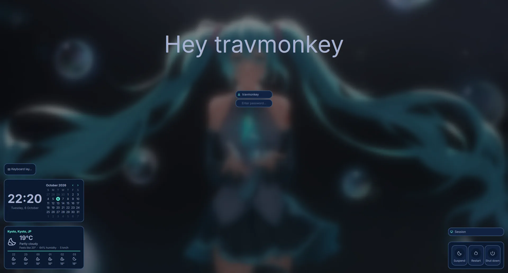 |

- **Lock screen modes:**
  - **Built-in** (`ext-session-lock`, PAM): the lock screen is laid out on the Layouts page, like an overlay page. Put a greeting, the password field, a clock, media, weather, power buttons (suspend, restart, shut down) and other display-only modules anywhere on a screen-sized grid. It shows over your wallpaper (blurred and dimmed) or a color, and **Show on screen** previews it.
  - **hyprlock:** a themed config that axiom generates.
  - **None:** use your own locker.
- **Login screen:** optional, through greetd.
  - Laid out the same way, with a login box (pick or type the user, with their picture), a session picker, the keyboard layout, power buttons and the same display-only modules.
  - Drawn in your theme, wallpapers and monitor layout.
  - Remembers the last user and their session.
  - Installed and updated from Settings with one password prompt; changing its look needs none. See [Login screen](installation.md#login-screen-greetd).
- **Polkit prompt:** when an app asks for admin rights, the screen dims and a password prompt opens on the focused monitor, in your theme.
  - Switch which identity to authenticate as.
  - Turn it on under **Settings → Screen & Power → Authentication prompts**. axiom stops the other agent you had (hyprpolkitagent, KDE's, GNOME's), and starts it again if you turn axiom's off.

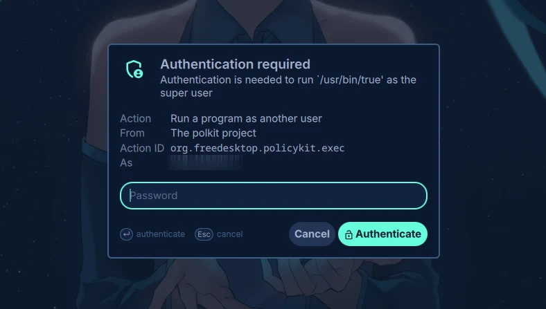

## Theming

| Dark | Light |
| :---: | :---: |
| 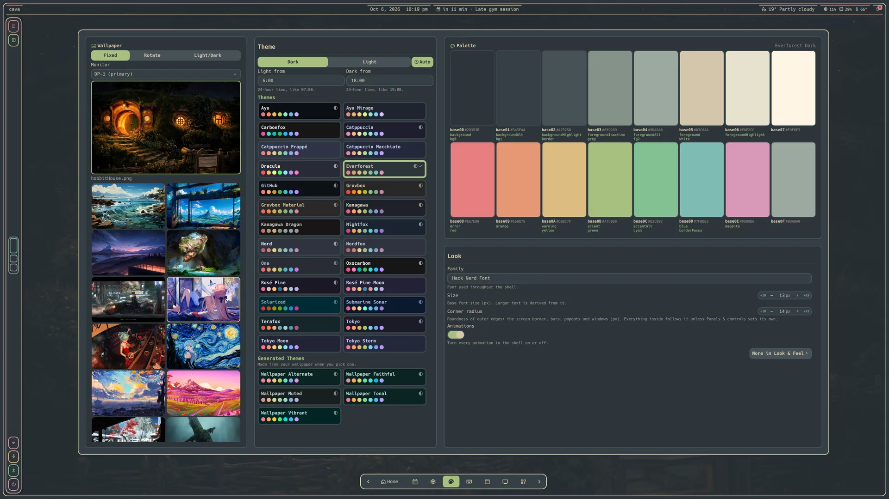 | 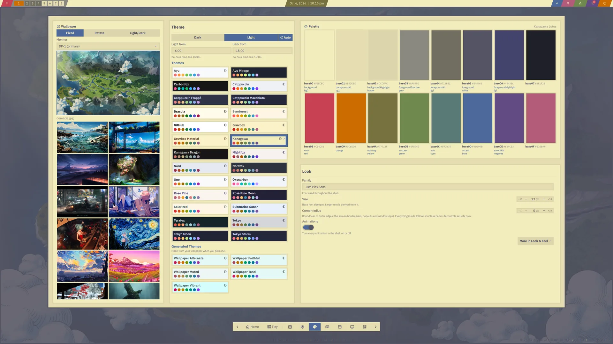 |

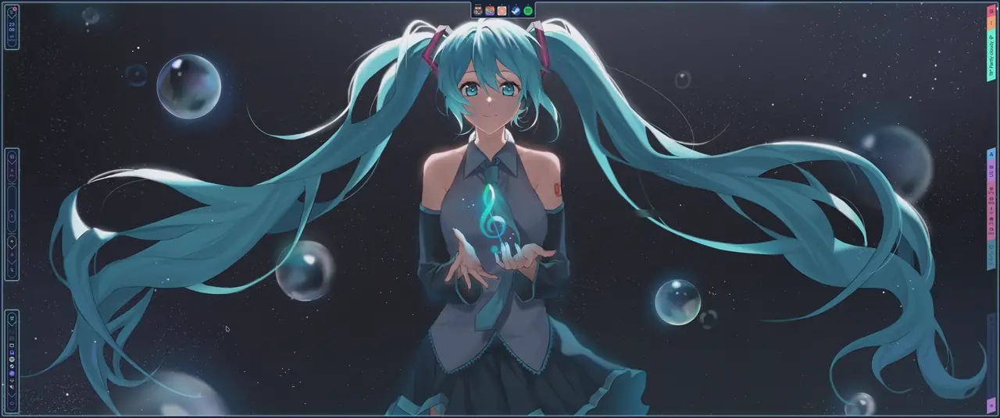

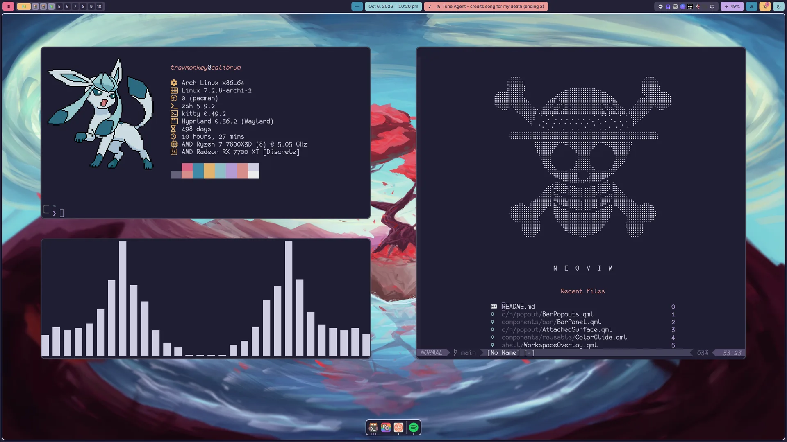

- **42 base16 themes**, with dark and light pairs switched by one toggle: Catppuccin, Gruvbox, Gruvbox Material, Solarized, Tokyo Night, Rosé Pine, Nord, Dracula/Alucard, Everforest, Kanagawa, One, Ayu, Nightfox (with Carbonfox, Dayfox, Nordfox and Terafox), GitHub, Oxocarbon and Submarine Sonar.
- **Generated themes** from your wallpaper, in five styles (tonal, vibrant, faithful, muted, alternate). The palette is built in OKLCH from the image's main colors, to match the contrast of the hand-made themes.
- **Light and dark** by hand, or on a schedule.
- **Wallpapers** can be set per monitor:
  - Fixed, rotating on a timer, or one for light mode and one for dark.
  - axiom draws them itself (crossfading), or uses [awww](https://github.com/LGFae/awww) for its transitions.
- **Other apps** follow the active theme too:
  - Each app is a switch under **Settings → Look & Feel → Theme integrations**, and gets its own `axiom` theme file.
  - Its switch shows the line that loads that file from the app's config. Copy the line, or click **Apply**, which backs your config up first.
  - Nothing else ever edits your config files.

<b>Supported apps (23)</b>

| Kind | Apps |
| --- | --- |
| Toolkits | GTK, Qt |
| Terminals | kitty, Alacritty, foot, WezTerm, Ghostty |
| Editors | Neovim, Helix, VS Code, Zed |
| Apps | Firefox (and its forks), Vesktop/Vencord, zathura |
| CLI tools | k9s, cava, btop, fzf, lazygit, bat/delta, Yazi, ncspot |
| Lockscreen | hyprlock |

## The rest

| Notification | Power menu | First-run setup |
| :---: | :---: | :---: |
| 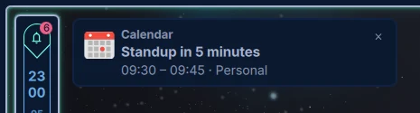 | 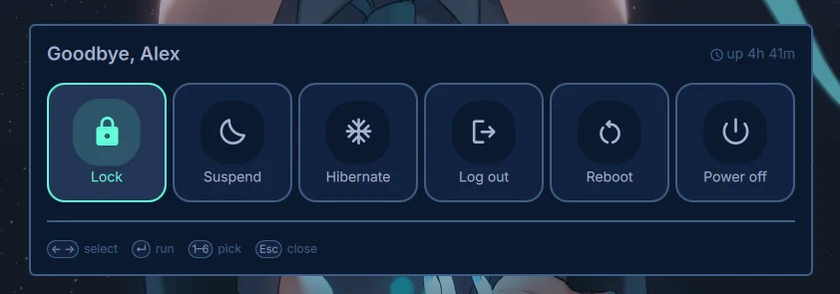 | 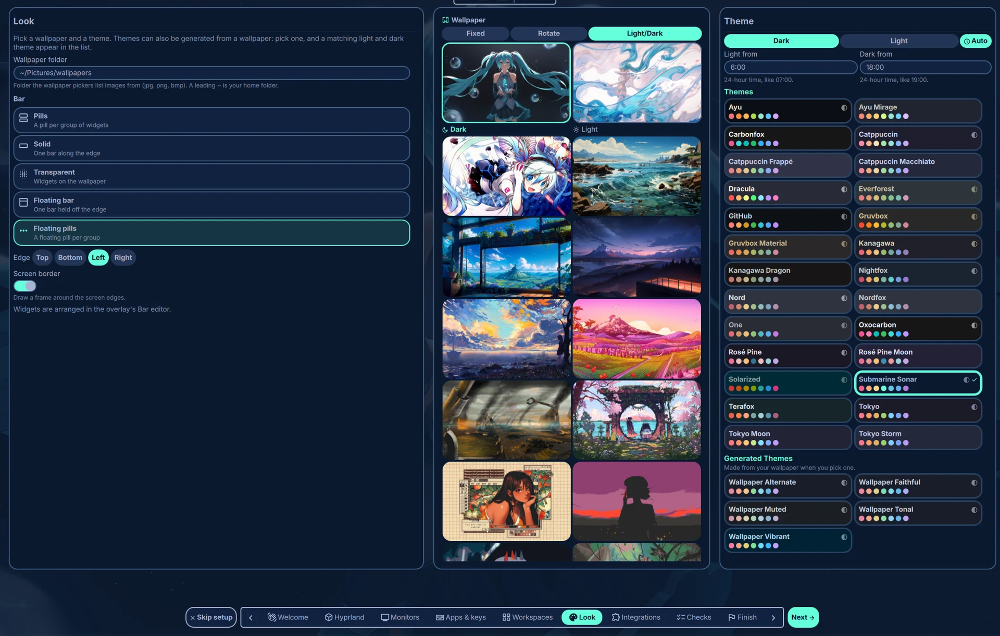 |

- **Notifications:** toasts and a notification center.
  - Toasts stack from any corner of one monitor or all of them, with gaps measured from the bar or border at each edge.
  - Set how long they stay (or use the app's own timeout), keep critical ones up, and keep them quiet over fullscreen windows.
  - The history can drop an app's notifications when you focus it, or when you click or close them, and has a size and age limit.
  - Do not disturb is kept across restarts.
- **AI chat:** Anthropic, OpenAI, Gemini, or anything with an OpenAI-style API (Ollama, LM Studio, OpenRouter, …).
  - Replies stream in as formatted Markdown with copyable code blocks and folded thinking.
  - Saved conversations, and presets (system prompt, model, effort).
  - Image attachments: paste, screenshot a region, or drop.
  - `@` in the launcher asks a question.
  - API keys come from environment variables, your keyring or a mode-600 secrets file, never `config.json`.
- **Notes:** Markdown files in a folder you choose, edited in place with task checkboxes. A note open in two places stays in sync, and `/notes` in the launcher searches them all.
- **Power menu:** your choice of session actions, in your order, driven by mouse or keyboard. Log out, reboot and power off ask you to confirm.
- **Monitors:** a page to arrange monitors by dragging (they snap edge to edge).
  - Set each one's mode, scale, rotation, mirroring, VRR, bit depth and color management.
  - One layout is kept per set of connected monitors, and switches on its own when you plug one in.
  - **Apply** asks you to keep the change, and puts the old layout back after 15 seconds if you don't.
- **Multi-monitor:** interactive surfaces open on the primary monitor, on whichever monitor has focus, or on all of them at once.
- **First-run setup:** a guided tour, applied as you go, through:
  - the look, monitors and workspaces
  - default apps and keys
  - Hyprland's mode, and the optional integrations (login screen, polkit, idle)

  `/welcome` runs it again.
- **Screenshots:** a region, a window or a whole screen, picked on a frozen frame. Saved and copied, or opened in satty or swappy to annotate. Also screen recording with `wf-recorder`.
- **Brightness:** keys and an OSD bar for a laptop screen and for external monitors over DDC/CI.
- **Night light:** warmer colors on a schedule, through `hyprsunset` or `wlsunset`.
- **Idle:** axiom can run hypridle from its own settings: dim, lock, screen off and suspend timeouts.
- **Updates:** axiom updates itself from git, following releases or `main`, with a notification or automatically.
- **Translations:** English and Japanese, with more added as a single JSON file each.

<b>AI chat</b>

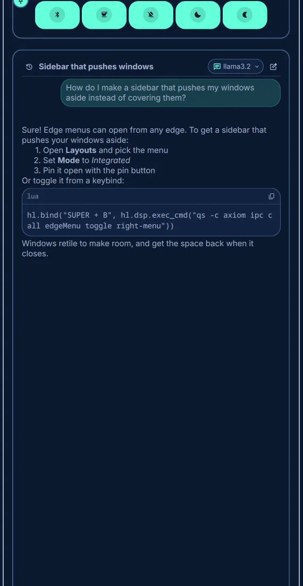

