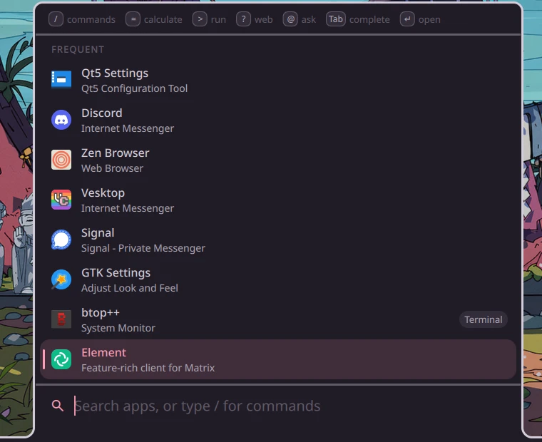
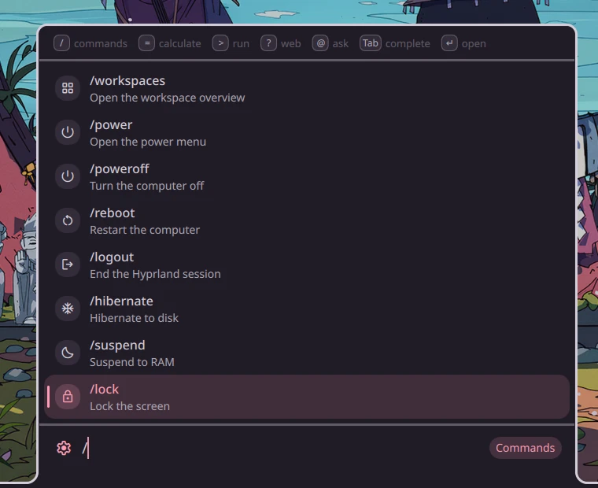
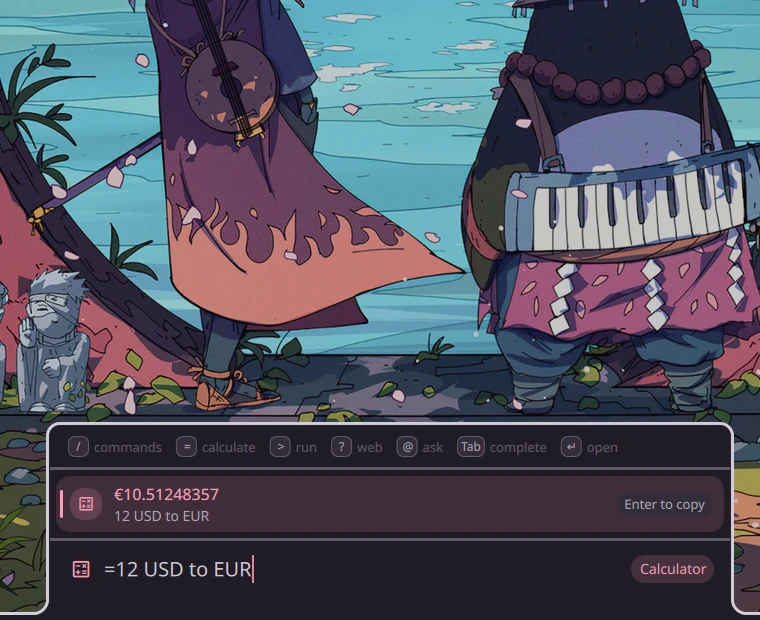

# Keybinds, IPC and launcher

[README](../README.md) · [Features](features.md) · [Installation](installation.md) · [Keybinds, IPC and launcher](usage.md) · [Configuration](configuration.md)

## Keybinds and IPC

Every surface can be controlled over Quickshell IPC, so you can bind it to anything:

```bash
qs -c axiom ipc call <target> <function>
```

<details>
<summary><b>IPC targets</b></summary>

| Target | Functions |
| --- | --- |
| `overlay` | `open`, `close`, `toggle`, `page <type>` |
| `edgeMenu` | `open <id>`, `close <id>`, `toggle <id>`, `pin <id>`, `unpin <id>`, `list`, `edit` |
| `dock` | `open <id>`, `close <id>`, `toggle <id>` (no id: every dock) |
| `appLauncher` | `open`, `close`, `toggle`, `search <text>` |
| `powermenu` | `open`, `close`, `toggle` |
| `workspaceOverlay` | `show`, `hide`, `toggle` |
| `workspaces` | `go <id>`, `move <id>`, `moveSilent <id>`, `left`, `right`, `up`, `down`, `step <direction> <mode>`, `nth <n> <mode>` |
| `idleInhibit` | `enable`, `disable`, `toggle`, `status` |
| `nightLight` | `enable`, `disable`, `toggle`, `status` |
| `brightness` | `up`, `down`, `set <percent>`, `dim <percent>`, `dimBy <percent>`, `undim` |
| `screenshot` | `take <region\|window\|screen>`, `cancel` |
| `screenRecord` | `toggle`, `enable`, `disable`, `status` |
| `wallpaper` | `next` |
| `monitors` | `open`, `keep`, `revert`, `identify` |
| `onboarding` | `open`, `close`, `goTo <step>`, `reset` |
| `lockscreen` | `lock` |
| `notifications` | `clear`, `toggleDnd` |
| `selfUpdate` | `check`, `update`, `open` |
| `chat` | `open`, `newChat`, `ask <text>`, `settings` |
| `audio` | `volumeUp`, `volumeDown`, `toggleMute`, `toggleMicMute` |
| `media` | `playPause`, `next`, `previous`, `stop` |

</details>

If you bind them in your own `hyprland.lua` instead of through axiom's settings, it looks like this. A `"Section: Label"` description sets where the bind appears on the Keybinds page:

```lua
hl.bind("SUPER + SPACE", hl.dsp.exec_cmd("qs -c axiom ipc call appLauncher toggle"), { description = "Axiom: App launcher" })
hl.bind("SUPER + T", hl.dsp.exec_cmd("qs -c axiom ipc call appLauncher search '/theme '"), { description = "Axiom: Themes" })
```

## Launcher

Plain text searches apps and open windows. When the text is math, the result shows first, and a web search comes last. A prefix picks one kind of search:

| Prefix | Does |
| --- | --- |
| `/` | Shell commands (list below) |
| `=` | Calculator (qalc: math, units, currencies). Enter copies the result |
| `>` | Runs a shell command. Shift+Enter runs it in your terminal |
| `?` | Web search, with the engine set in Settings |
| `@` | Asks the overlay's chat, in a new conversation |
| `:` | Clipboard history. Shift+Enter removes an entry |
| `;` | Emoji, searched by name and keyword. Enter copies one, Shift+Enter also types it (with `wtype`) |

| | Apps | Commands | Calculator |
| --- | :---: | :---: | :---: |
| **A:** attached to the top, field above |  |  |  |
| **B:** attached to the bottom, field below |  |  |  |

<kbd>Tab</kbd> completes a command or its argument. Commands that change something you can see, like the theme, volume or wallpaper, keep the launcher open, so you can try several. `logout`, `reboot` and `poweroff` ask for a second <kbd>Enter</kbd>.

| Group | Commands |
| --- | --- |
| **Session** | `/lock` `/suspend` `/hibernate` `/logout` `/reboot` `/poweroff` `/power` |
| **Pages** | `/overlay [page]` `/settings` `/themes` `/bar` `/keybinds` `/editor` `/menus` `/monitors` `/workspaces` |
| **Look** | `/theme <name>` `/dark` `/light` `/mode` `/wallpaper <file\|Random>` `/nextwallpaper` `/generate` `/nightlight` |
| **Audio and media** | `/volume <n\|+n\|-n>` `/mute` `/mic` `/output <device>` `/input <device>` `/play` `/next` `/prev` |
| **Connectivity** | `/wifi [on\|off]` `/bluetooth [on\|off]` `/connect <device>` |
| **Other** | `/dnd [on\|off]` `/clear` `/caffeine [on\|off]` `/ws <n>` `/screenshot <region\|window\|screen>` `/record` `/notes [text]` `/chat [conversation]` `/config <setting> <value>` `/config save <name>` `/config restore <name>` `/update` `/welcome` `/reload` `/emoji` `/clipboard` `/help` |

Every provider can be switched off under **Settings › Desktop › Launcher**. The same page sets:
- the launcher's size, hidden apps, terminal and search engine
- where it opens: floating (centered or in the upper third), or attached to the top or bottom edge like the other edge popouts
- whether the search field sits above or below the results
